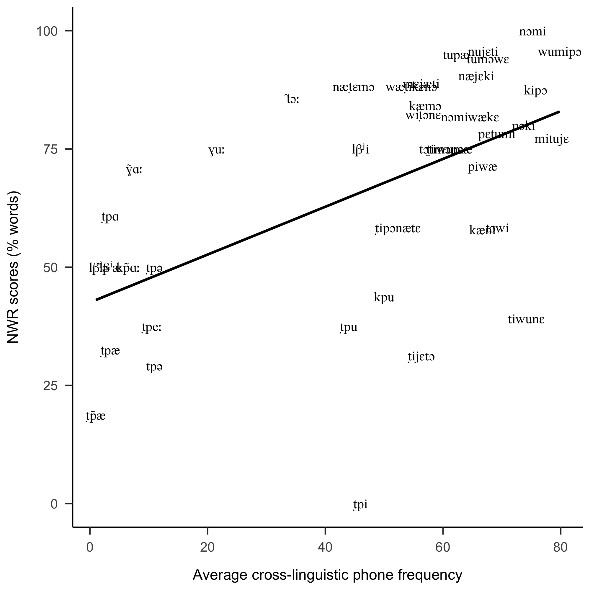

```{r setup, include=FALSE}
REDOALL=FALSE #use true if you want to recalculate the final-data and other data sheets

#Sys.setlocale("LC_CTYPE", "en_US_POSIX.UTF-8")
#Sys.setlocale("LANG", "en_US_POSIX.UTF-8")
Sys.setlocale(category = "LC_ALL", locale = "en_SE.utf8")

knitr::opts_chunk$set(warning = FALSE, message = FALSE, cache = FALSE, fig.pos = "T")
require("papaja")
library(kableExtra)
library(gdata)
library(tidyverse)
library(lme4)
library(openxlsx)


p.levels <- c(0, 0.001, 0.01)
pval.display <- function(p.est) {
  level <- findInterval(p.est, p.levels)
  p.string <- ifelse(level == 3, paste0("= ", round(p.est, 2)),
    ifelse(level == 2, "< 0.01", "< 0.001"))
  return(p.string)
}

print.phone.list <- function(charlist) {
  printout <- ""
  for (c in 1:length(charlist)) {
    if (c == length(charlist)) {
      printout <- paste0(printout, "and [", charlist[c], "]")
    } else {
      printout <- paste0(printout, "[", charlist[c], "], ")
    }
  }
  return(printout)
}

correspondances=matrix( #list correspondances always by pairs, orthography then phonology
  c(
    #nasal  to unichar
    ":ii","ì",
    ":ee","è",
    ":aa","à",
    ":êê","3",
    ":ââ","6",
    ":uu","ù",
    ":oo","Ò",
    #long to unichar
    "ii","ï",
    "ee","ë",
    "éé","Ë",
    "áá","Ä",
    "aa","ä",
    "îî","Ï",
    "êê","2",
    "ââ","5",
    "uu","ü",
    "óó","ö",
    "oo","Ö",
    #short nasal
    ":i","1",
    ":e","4",
    ":a","ã",
    ":ê","6",
    ":â","7",
    ":u","8",
    ":o","9",
    #consonants, veeeery dirty!
    "'n","ń",
    "tp",":",
    "dp","/",
    "kp","P",
    "ngm","G",
    "ńm","M",
    "ng","N",
    "mb","b",
    "nd","D",
    "nt","T",
    "nk","K",
    "dn","?",
    "kn","!",
    "vy","V",
    "mt","C",
    "md","J",
    "mg","X",
    "dm","S",
    "km","Z",
    "gh","H",
    "lv","L"
  ),#last item above should not have a comma
  ncol = 2,byrow = T)

cohensd=function(m,sd){round(m/sd,3)}
cohensd2=function(m1,sd1,m2,sd2){round((m1-m2)/sqrt((sd1^2+sd2^2)/2),3)}


```


```{r demo}
# please note that you will not be able to do this because you don't have this version, that is not fully de-identified
# read.csv("NWR-test-log_FINAL.csv",header=T,sep=";")->fulldemo
# fulldemo=fulldemo[,-2] #remove children's names
# fulldemo$dob=as.Date(as.character(fulldemo$DOB.ISO),format="%Y%m%d")
# fulldemo$test=as.Date(as.character(fulldemo$Date),format="%Y%m%d")
# fulldemo$age.rounded=as.numeric(difftime(fulldemo$test,fulldemo$dob,unit="weeks"))/52.25
# fulldemo$Age=as.numeric(as.character(fulldemo$Age))
# plot(fulldemo$Age~fulldemo$age.rounded)
# write.csv(fulldemo,"nwr-demo.csv")

# read.csv("nwr-demo.csv",header=T)->demo
# demo=demo[,-c(20,21)] #remove DOBs 
# write.csv(demo,"nwr-demo.csv")

read.csv("nwr-demo.csv",header=T)->demo
#colnames(demo)


subset(demo,included=="yes" & Age <12 & !is.na(Age))->inc
#if age.rounded is missing, use reported age
inc$age.rounded[is.na(inc$age.rounded)]<-inc$Age[is.na(inc$age.rounded)]
#summary(inc)
table(inc$birthOrder)->birthorder.tab


```


```{r readin}
read.table("final_data.txt",header=T,encoding="UTF-8")->trnsc

trnsc$Sex=factor(trnsc$Sex)
trnsc$birthOrder=as.numeric(trnsc$birthOrder)

# Include only included children in trnsc
trnsc[which(trnsc$id %in% inc$ID),]->trnsc.inc

```


```{r exclude subsequent}
trnsc.inc-> trnsc.inc_all #keep a copy for figure comparing first & subsequent

trnsc.inc=trnsc.inc[trnsc.inc$attempt=="first",]

```

## TODO

1. add a table with sample studies & languages & their characteristiscs
1. be accurate on what hasn't been done x-ling speaking
1. try to find data on length distribution across languages to see if this fits length differences
1. to the above, add sylable characteristics, inventory size, inventory compactness
1. fix camila ref


## Introduction

Children's perception and production of phonetic and phonological units continues developing well beyond the first year of life, even extending into middle childhood [e.g., @hazan2000development]. Much of the evidence for later phonological development comes from nonword repetition (NWR) tasks. In a NWR task, participants hear a short word-like form that is phonologically legal but lexically meaningless in the language(s) they are learning. After hearing this non-word, the participant's task is to try to immediately and precisely repeat it. NWR scores are thought to reflect long-term phonological knowledge (to perceive the item precisely despite not having heard it before) as well as online phonological working memory (to encode the item in the interval between hearing it and saying it back) and flexible production patterns (to produce the item precisely despite not having pronounced it before). 

NWR has been used to seek answers to a variety of theoretical questions, including what the links are between phonology, working memory, and the lexicon [@bowey2001nonword], and how extensively phonological constraints found in the lexicon affect online production [@gallagher2014identity]. NWR is also frequently used in applied contexts, notably as a diagnostic tool for language delays and disorders [@estes2007differences]. Since non-words can be generated in any language, it has attracted the attention of researchers working in multilingual and linguistically diverse environments, particularly in Europe [@meir2016disentangling;@is08042009language]. 

In the present study, we use NWR to investigate the phonological development of children learning Yélî Dnye, an isolate language spoken in Papua New Guinea (PNG) that has a large and unusually dense phonological inventory. The study was designed to contribute to four aspects of our understanding of phonological development. 

First, we included a subset of non-word items with typologically rare and/or challenging sounds to ask whether these rare sounds are disadvantaged in the perception-production loop involved in NWR. Previous work using NWR has preferred relatively universal and early-acquired phonemes [with the possible exception of @gallagher2014identity], likely as a way to separate phoneme pronunciation from broader syllable structure and word-level prosodic effects [@gallon2007non]. Here, we investigate repetition of non-word items containing cross-linguistically common and cross-linguistically rare phonetic targets. 

Second, we varied the length (in syllables) of non-words to contribute to growing research looking at the impact of word length on NWR repetition, and what this may reflect about phonological development. Our reading of previous NWR research is that there are variable effects of length between populations. For instance, @jabere2018xperiment reports an average of ~96% correct repetition for items 2 syllables long among children learning an Arabic variety of Israeli at about 5.5 years of age, but ~81% for items 3 syllables long. In contrast, @piazzalunga2019articulatory observe no decline in performance in similarly-aged Italian learners, with a score of 84% for 2 syllables versus 85% for 3 syllables. It is possible that differences are due to a host of variables, including the modal length of words in the language and/or in child-directed speech in that culture. That said, there could be other causal pathways: Research on adults suggests that illiterate Portuguese speakers repeat monosyllabic non-words just as accurately as literate adults, whereas scores are much lower among illiterate than literate speakers for items 3 or 4 syllables long [@de2004degree]. Given that both groups of adults speak the same language (Brazilian Portuguese), then perhaps differences in repetition accuracy reveal differences in how flexible the perception-production loop is. Given the paucity of evidence looking at this question, we do not approach this issue within a hypothesis-testing framework but sought instead to provide one more piece of data on the question, which may be re-used in future meta- or mega-analytic approaches.

Third, there are ongoing discussions as to what the key factors structuring individual variation are. Although the ideal systematic review is missing, a recent paper comes close with a rather extensive review of the literature looking at correlations between NWR scores and a variety of child-level variables [@farabolini2021nonword]. In a nutshell, most evidence is mixed, suggesting that consistent individual variation effects may be small, and more data is needed to estimate their true size. For this reason, we descriptively report association strength between NWR scores and child age, sex, birth order, and maternal education. Based on previous work, we looked at potential increases with age [@farmani2018normalization; @kalnak2014nonword; @vance2005speech]. Previous work typically finds no significant differences as a function of maternal education [e.g., @farmani2018normalization; @kalnak2014nonword; @meir2017independent; @balladares2016socio] or child gender [@chiat2007preschool]. Although past research has not often investigated potential effects of birth order on NWR, there is a sizable literature on these effects in other language tasks [@havron2019effect], and therefore we report on these too.

Fourth, these data contribute to the small literature using this task with non-Western, non-urban populations, speaking a language with a moderate to large phonological inventory [see @maddieson2005correlating for a broad classification of languages based on inventory size]. Indeed, NWR has seldom been used outside of Europe and North America [with exceptions including @gallagher2014identity; @cristia2020infant], and/or outside urban settings [except for in @cristia2020infant], nor with languages having large phonological inventories [e.g., more than 34 consonants and 7 vowel qualities @maddieson2013vowel;@maddieson2013consonant; no exceptions to our knowledge]. There are no theoretical reasons to presume that the technique will not generalize to these new conditions. That said, @cristia2020infant recently reported relatively lower NWR scores among the Tsimane', a non-Western rural population, interpreting these findings as consistent with the hypothesis that lower levels of infant-directed speech and/or low prevalence of literacy in a population could lead to population-level differences in NWR scores. In view of these results, it is important to bear in mind that NWR is a task developed in countries where literacy is widespread, and it is considered an excellent predictor of reading, for instance better than rhyme awareness [e.g., @gathercole1991differentiating]. Therefore, it may not be a general index of phonological development, but more specifically reflect certain non-universal skills. Indeed, @cristia2020infant present the task as being a good index of the development of "short-hand-like" representations specifically, which could thus miss, for example, more holistic phonological and phonetic representations. To our knowledge, there is little discussion of linguistic effects -- i.e., of potential differences in NWR as a function of language typology -- or cultural effects -- i.e., of potential differences in NWR as a function of other differences across human populations, aside from @cristia2020infant's hypotheses just mentioned. Regarding potential language differences, we note that the very fact that studies compose items by varying syllable structure and word length, while prefering relatively simple and universal phones (notably relying on point vowels, simple plosives, and fricatives that are prevalent across languages, like /s/) may indicate a bias towards Indo-European languages, where syllable structure and word length are indeed important structural dimensions. This bias is, of course, implicit and unintentional, arising as researchers working in other languages attempt to build items that conform to the descriptions of the first people using the method, who tend to work on English. And it does occur that some researchers opt instead to employ dimensions of variation that are more relevant to their language, such as adaptations in Chinese languages that have items varying in tone REF. **return to this after reading lit**

Before going into the details of our study design we first give an overview of Yélî Dnye phonology as well as a brief ethnographic review of the developmental environment on Rossel Island. As discussed above, NWR has been almost exclusively used in urban, industrialized populations, so we provide this additional ethographic information to contextualize the adaptations we have made in running the task and collecting the data, compared to what is typical in commonly studied sites, which are typically easily accessible. Laying 250 nautical miles off the coast of mainland PNG and surrounded by a barrier reef, transport to and from Rossel Island is both infrequent and irregular. <!--Removed for brevity: Most Yélî people are swidden horticulturalists who cultivate yams, manioc, taro, coconut, banana, and more, getting protein primarily from fish, shellfish, and nuts. There is no electricity system (visiting researchers use solar panels) or motor vehicles on the island, save dinghys with outboard motors that are primarily reserved for medical transport. News and messages are passed to and from mainland PNG via a radio connection at the local health clinic and, when it is functioning, a cellular tower on the island.--> International phone calls and digital exchanges that require significant data transfer are typically not an option. Data collection is therefore typically limited to the duration of the researchers' on-island visits.

### Yélî Dnye phonology

Yélî Dnye is an isolate language (presumed Papuan) spoken by approximately 7,000 people residing on Rossel Island, an island found at the far end of the Louisiade Archipelago in Milne Bay Province, Papua New Guinea. The Yélî sound system, much like its baroque grammatical system [@levinsonYDgrammar], is unlike any other in the region. In total, Yélî Dnye uses 90 distinctive segments (not including an additional three rarely used consonants), far outstripping the phonemic inventory size of other documented Papuan languages [@foley1986papuan; @levinsonYDgrammar; @maddiesonIPphoneticsYD]. Thus, with respect to our first research goal, Yélî Dnye seemed is a good language to attempt an investigation on NWR with sounds varying in cross-linguistic frequency because of its large inventory, which includes some rare sounds.

<!--
Removed for brevity:
and includes at least two contrasts that had not previously been documented elsewhere [labial-coronal double-articulations with dental vs. post-alveolar coronal placement for both oral and nasal stops, @ladefoged1996sounds; @maddiesonIPphoneticsYD].
--> 

To provide some qualitative information on this inventory, we add the following observations. With only four primary places of articulation (bilabial, alveolar, post-alveolar, and velar) and no voicing contrasts, the phonological inventory is remarkably packed with acoustically similar segments. The core oral stop system includes both singleton (/p/, /t/, /ṭ/, and /k/) and doubly-articulated (/tp/, /ṭp/, /kp/) segments, with full nasal equivalents (/m/, /n/, /ṇ/, /ŋ/, /nm/, /ṇm/, /ŋm/), and with a substantial portion of them contrastively pre-nasalized or nasally released (/mp/, /nt/, /ṇṭ/, /ŋk/, /nmtp/, /ṇmṭp/, /ŋmkp/, /ṭṇ/, /kŋ/, /ṭpṇm/, /kpŋm/). A large number of this combinatorial set can further be contrastively labialized, palatalized on release, or both (e.g., /pʲ/, /pʷ/, /pʲʷ/; /tpʲ/; /ṇmḍbʲ/; see @levinsonYDgrammar for details).^[We use Levinson's [-@levinsonYDgrammar] under-dot notation (e.g., /ṭ/) to denote the post-alveolar place of articulation; these stops are, articulatorily, somewhat variable in place, with at least some tokens produced fully sub-apically. In approximating cross-linguistic segment frequency below we use the corresponding retroflex for each stop segment (e.g., /ʈ/, /ʈp/, /ɳ/).] The consonantal inventory also includes a number of non-nasal continuants (/w/, /j/, /ɣ/, /l/, /βʲ/, /lʲ/, /lβʲ/). Vowels in Yélî Dnye may be oral or nasal, short or long. The 10 oral vowel qualities, which span four levels of vowel height, (/i/, /ɯ/, /u/, /e/, /o/, /ə/, /ɛ/, /ɔ/, /æ/, /ɑ/) can be produced as short and long vowels, with seven of these able to appear as short and long nasal vowels as well /ĩ/, /ũ/, /ə̃/, /ɛ̃/, /ɔ̃/, /æ̃/, /ɑ̃/).

Regarding our second research goal, on the effect of non-word length on NWR, most Yélî Dnye words are bisyllabic (~50%), with monosyllabic words (~40%) appearing most commonly after that, and with tri-and-above syllabic words appearing least frequently [~10%; based on >5800 lexemes in the most recent dictionary at the time of writing; @levinsonYDgrammar]. The vast majority of syllables use a CV format. A small portion of the lexicon features words with a final CVC syllable, but these are limited to codas of -/m/, -/p/, or -/j/ (e.g., "ndap" /ṇṭæp/ *Spondylus shell*) and are often resyllabified with an epenthetic /ɯ/ in spontaneous speech (e.g., "ndapî" /'ṇṭæ.pɯ/). There are also a handful of words starting with /æ/ (e.g., "ala" /æ.'læ/ *here*) and a small collection of single-vowel grammatical morphemes (see @levinsonYDgrammar for details).

Our knowledge of Yélî language development is growing [e.g., @brown2011cultural; @brown2014interactional; @brownIPchildrearing; @casillas2020early; @liszkowski2012prelinguistic], but research into Yélî phonological development has only just begun [e.g., @peuteIPconsonants]. We hope the present study contributes to filling this gap. **TODO incorporate brief summary of paper**

<!--
NOTE: The following paragraph was removed b/c it's less relevant, but it has been double-checked by MC Nov 2020 in case we decide to include it later:

While all consonants can appear in the first syllable of the word, the second syllable onset consonant in bisyllabic roots is almost exclusively drawn from a subset of the simplex consonants (in order of descending frequency: /m/, /ṭ/, /n/, /p/, /l/, /w/, /j/, /pʷ/, /ŋ/, /k/, /t/, /ɣ/, /mʷ/). In monosyllabic stems, oral vowels (short: 43% and long: 31%) are more common than nasal ones (short: 4% and long: 22%), with the first syllable of bisyllabic stems following a similar pattern. Most vowels in the second syllable of bisyllabic stems are also short and oral, with a potential preference for rounding harmony between the first and second vowels. Stress typically falls on the first syllable of bisyllabic words, on the first and third syllables of tetrasyllabic words, and on the first or second syllable of trisyllabic words, depending on its vocalic features (see @levinsonYDgrammar for details).
-->

### The Yélî community

Some aspects of the community are relevant for interpreting results found when addressing our thir research question, regarding sources of individual variation. Specifically, we investigated potential effects of age, gender, maternal education, and birth order. There is nothing particular to note regarding age and gender, but we have some comments that pertain to the other two factors.

The typical household in our dataset includes seven individuals (typically, a mixed sex couple and children -- their own and billeting others, as discussed in the next paragraph) and is situated among a collection of four or more other households, with structures often arranged around an open grassy area. These household clusters are organized by patrilocal relation, such that they typically comprise a set of brothers, their wives and children, and their mother and father, with neighboring hamlets also typically related through the patriline. Land attribution for building one's home is decided collectively based on land availability, and typically does not take into consideration an individual's desire to be close to a school. 

Most Yélî parents are swidden horticulturalists, and those who are not may not reside in the island. Within a group of households, it is often the case that most older adolescent and adults spend their day tending to their gardens (which may not be nearby), bringing up water from the river, washing clothes, preparing food, and engaging in other such activities, which leave them little time to spend directly with the children in their household (other than infants). Starting around age two years, children more often spend large swaths of their day playing, swimming, and foraging for fruit, nuts, and shellfish in large (~10 members) independent and mixed-age child play groups [@brownIPchildrearing; @casillas2020early]. Formal education is a priority for Yélî families, and many young parents have themselves pursued additional education beyond of what is locally available [@casillas2020early]. Local schools are well out of walking distance for many children (i.e., more than 1 hour on foot or by canoe each day), so it is very common for households situated close to a school to billet their school-aged relatives during the weekdays for long segments of the school year. Children start school often at around age six, although the precise age depends on the child's apparent development.


Some general ideas regarding potential maternal education effects on our data may be drawn from the observations above. To begin with, many of our participants above 6 years of age may not be living with their birth mother but with other relatives, which may weaken maternal education effects. Additionally, the importance given to formal education appears relatively stable over the period that Rossel Island has been visited by language researchers (Steven Levinson and Penelope Brown, about 20 years). Together with the fact that land attribution is essentially random with respect to educational hopes, it seems to us that the length of formal education a given individual may have is not necessarily a good index of their socio-economic status or other individual properties, unlike what happens in industrialized sites, and variation may simply due to random factors like living close to a school or having relatives there.

As for birth order, much of the work on birth order effects on cognitive development (including language) has been carried out in the last 70 years and in agrarian or industrialized settings [@gratz2018competition;@barclay2015within], where nuclear families are more likely to be the prevalent rearing environment [@lancy2015anthropology]. It is possible that birth order effects are stronger in such a setting, because much of the stimulation can only come from the parents, and when there are multiple children, the inter-birth interval is small enough that older siblings may not be of an age that allows them to contribute to their younger siblings' stimulation. This contrasts with this picture just drawn in the Yélî community, where children regardless of their birth order in their nuclear family will typically benefit from a rich and extensive socially stimulating setting, surrounded by siblings, and cousins of several orders. 

We add some observations that will help us integrate this study to the broader investigation of NWR across cultures. As mentioned previously, there is one report of lower NWR scores among the Tsimane', which the authors interpret as consistent with long-term effects of low levels of infant-directed speech [@cristia2020infant]. However, @cristia2020infant also point out that this is based on between-paper comparisons, and thus methods and a myriad other factors have not been controlled for. The Yélî community can help us bring further light into this question because direct speech to children under 3;0 is relatively infrequent in this community too [@casillas2020early]. Although infant-directed speech has been measured in different ways among the Tsimane' and the Yélî communities, our most comparable estimates at present suggests that Tsimane' young children are spoken to about 4.2 minutes per hour [@scaff2021daylong], and Yélî children about 3.7 minutes per hour [@casillas2020early]. Thus, if input quantities in early childhood are a major determinant of NWR scores, we should observe similarly low NWR scores as in @cristia2020infant.

### NWR design and analysis adaptations

In a basic NWR task, the participant listens to a production of a word-like form, such as /bilik/, and then repeats back what they heard without changing any phonological feature that is contrastive in the language. For instance, in English, a response of [bilig] or [pilik] would be scored as incorrect; a response [biːlik], where the vowel is lengthened without change of quality would be scored as correct, because English does not have contrastive vowel length. There is some variation in how past NWR studies have designed the presentation procedure and structure of items. For example, while items are often presented orally by the experimenter [@torrington2015non], an increasing number of studies have turned instead to playing back pre-recorded stimuli in order to increase control in stimulus presentation [@brandeker2015language]. Additionally, while some studies have used 10-15 non-words [e.g., @cristia2020infant], others have employed up to 46 unique items [@piazzalunga2019articulatory]. Authors also often modulate structural complexity, typically measured in terms of item length (measured in number of syllables) and/or syllable structure [open as opposed to closed syllables, @gallon2007non].

Previous work typically steers clear of articulatorily and/or acoustically challenging sounds, but we included some in our experiment to more adequately represent Yélî Dnye's phonology and to contribute data on whether this affects repetition. We ultimately used a relatively large number of items that would enable us to explore both variation in structural complexity and in more vs. less challenging sounds. However, aware that this large item inventory might render the task longer and more tiresome, we split items across children (see below). Naturally, designing the task in this way may make the study of individual variation within the population more difficult because different children are exposed to different items. However, as discussed above, effects of individual differences in NWR are probably relatively small, and thus we reasoned that they would not be detectable with the sample size that we could collect during our short visit. That said, we contribute to the literature by also reporting descriptive analyses of individual variation that could potentially be integrated in meta- or mega-analytic efforts.


### Research questions

After some preliminary analyses to set the stage, we perform statistical analyses to inform answers to the following questions:

- Does the cross-linguistic frequency of sounds in the stimuli predict NWR scores? Are rarer sounds more often substituted by commoner sounds?
- How do NWR scores change as a function of item length in number of syllables?
- Is individual variation in NWR scores attributable to child age, sex, birth order, and/or maternal education?

Throughout these analyses and in the Discussion, we will also have in mind our fourth goal, namely integrating NWR results across samples varying in language and culture.

We had considered boosting the interpretational value of this evidence by announcing our analysis plans prior to conducting them. However, we realized that even pre-registering an analysis would be equivocal because we would not have enough power to look at all relationships of interest, in many cases possibly not enough to detect any of the known effects, given the previously discussed variability across studies. Therefore, all analyses in the present study are descriptive and should be considered exploratory.


```{r fig-prevlit, echo = FALSE, ig.pos = "T!", fig.width=8, fig.height=5.5, fig.cap = "NWR scores as a function of age (in years) and item length for comparable studies (2-4 indicating number of syllables,  2=dashed, 3=dotted, 4=dotted and dashed). Jaber-Awida (2018) reported on 20 Arabic learners (orange); Piazzalunga et al. (2019) reported on groups of 24-60 Italian learners (black); Cristia et al. (2020) reported on groups of 4-6 Tsimane' learners (green); the present study reports on groups of 8-19 Yélî Dnye learners (purple). Central tendency is mean in Arabic and Tsimane', median in Italian and Yélî Dnye; error is one standard error. Age has been slightly jittered for ease of inspection of different lengths at a given age."}

pl<- read.csv("previous_lit.csv")

pl_stacked=cbind(pl[,1:4],stack(pl[5:8]),stack(pl[9:12]))
colnames(pl_stacked)[5:8]<-c("Median","Length","SD","sdtype")
pl_stacked$Length=gsub("X","",pl_stacked$Length)

#remove lines with NA median
pl_stacked[!is.na(pl_stacked$Median),]->pl_stacked


#add YD data
aggregate(trnsc.inc$correct*100,by=list(trnsc.inc$id,trnsc.inc$type,trnsc.inc$age.rounded),mean,na.rm=T)->m_ty_id_age #get means by child and length and age

age_cuts=c(3,6,8,13)
m_ty_id_age$age_g=cut(m_ty_id_age$Group.3,age_cuts) #apply cuts to define groups
m_ty_id_age$age_gm<-ifelse(m_ty_id_age$age_g=="(3,6]",4.5,ifelse(m_ty_id_age$age_g=="(6,8]",7,10))


aggregate(m_ty_id_age$x,by=list(m_ty_id_age$Group.2,m_ty_id_age$age_gm),median,na.rm=T)->yd_res #get avg across children within age groups
yd_res=cbind(yd_res,aggregate(m_ty_id_age$x,by=list(m_ty_id_age$Group.2,m_ty_id_age$age_gm),sd,na.rm=T)$x,aggregate(m_ty_id_age$x,by=list(m_ty_id_age$Group.2,m_ty_id_age$age_gm),length)$x) #add sd & ns

colnames(yd_res)<-c("Length","Age","Median","SD","n")
yd_res_toadd=cbind("This paper","Yélî Dnye",yd_res[,c("n","Age","Median","Length","SD")],NA)
colnames(yd_res_toadd)<-c("Study","Language","n","Age","Median","Length","SD","sdtype")

#combine
pl_stacked=rbind(pl_stacked,yd_res_toadd)

#add SE
pl_stacked$se=pl_stacked$SD/sqrt(pl_stacked$n)

#remove monosyllables
pl_stacked=pl_stacked[pl_stacked$Length!=1,]

mycols = c( 
             "Arabic" = "orange",
             "Italian"   ="black",
             "Tsimane'" = "darkgreen",
             "Yélî Dnye" = "purple")

mywd = c( 
             "Arabic" = 1,
             "Italian"   =1,
             "Tsimane'" = 2,
             "Yélî Dnye" = 4)

jit_age=(pl_stacked$Age+(as.numeric(as.character(pl_stacked$Length))-2)/5)
plot(pl_stacked$Median~jit_age,col=mycols[pl_stacked$Language],pch=as.character(pl_stacked$Length),
     xlab="Average age (years)",ylab="NWR Scores (words)",ylim=c(0,100))

for(thislang in levels(pl_stacked$Language)) for(thislength in levels(factor(pl_stacked$Length[pl_stacked$Language== thislang]))){
  myx=pl_stacked$Age[pl_stacked$Language==thislang & pl_stacked$Length==thislength]
  myx=myx+(as.numeric(as.character(thislength))-2)/5 #jitter the length lines a little bit with respect to avg age
  myy=pl_stacked$Median[pl_stacked$Language==thislang & pl_stacked$Length==thislength]
  lines(myy~myx, col=mycols[thislang],lty=as.numeric(thislength),lwd=mywd[thislang]) #join points of same length & lang
  mylb=myy-pl_stacked$se[pl_stacked$Language==thislang & pl_stacked$Length==thislength]
  myhb=myy+pl_stacked$se[pl_stacked$Language==thislang & pl_stacked$Length==thislength]
  for(i in 1:length(mylb)) {
    mylty=as.numeric(as.character(thislength))
    lines(rep(myx[i],2),c(mylb[i],myhb[i]),col=mycols[thislang],lty=mylty) #error bar
    lines(c(myx[i]-.1,myx[i]+.1),c(mylb[i],mylb[i]),col=mycols[thislang],lty=mylty) #lower error bar tip
    lines(c(myx[i]-.1,myx[i]+.1),c(myhb[i],myhb[i]),col=mycols[thislang],lty=mylty) #higher error bar tip
    }
} 


```


## Methods

### Stimuli

Many NWR studies are based on a fixed list of 12-16 items that vary in length between 1 and 4 syllables, often additionally varying syllable complexity and/or cluster presence and complexity, and always meeting the condition that they do not mean anything in the target language [e.g., @balladares2016socio; @wilsenach2013phonological]. We kept the same variation in item length and requirement for not being meaningful in the language, but we did not vary syllable complexity or clusters because these are vanishingly rare in Yélî Dnye. We also increased the number of items an individual child would be tested on, such that a child would get up to 23 items to repeat [other work has also used up to 24-30 items: @jabere2018xperiment; @kalnak2014nonword], with the entire test inventory of 40 final items distributed across children.

A first list of candidate items was generated during a trip to the island in 2018 by selecting simple consonants (/p/,	/t/,	/ṭ/,	/k/,	/m/,	/n/,	/w/,	/y/) and vowels (/i/, /o/, /u/, /a/, /e/) and combining them into consonant-vowel syllables, then sampling the space of 2- to 4-syllable sequences. These candidates were automatically removed from consideration if they appeared in Levinson's (2015) dictionary. The second author presented them orally to three local research assistants, all native speakers of Yélî Dnye, who repeated each form as they would in an NWR task and additinally let the experimenter know if the item was in fact a word or phrase in Yélî Dnye. Any item reported to have a meaning or a strong association with another word form or meaning was excluded.

A second list of candidate items was generated in a second trip to the island in 2019, when data were collected, by selecting complex consonants and systematically crossing them with all the vowels in the Yélî Dnye inventory to produce consonant-vowel monosyllabic forms. As before, items were automatically excluded if they appeared in the dictionary. Additionally, since perceiving vowel length in isolated monosyllables is challenging, any item that had a short/long lexical neighbor was excluded. Because there is still much to discover about the phonology and phonetics of Yélî Dnye [@levinsonYDgrammar], it was also possible that we initially generated items with illegal, but currently undocumented constraints. Therefore, we made sure that the precise consonant-vowel sequence occurred in some real word in the dictionary (i.e., that there was a longer word included the monosyllable as a subsequence). These candidates were then presented to one informant, for a final check that they did not mean anything. Together with the 2018 selection, they were recorded, based on their orthographic forms, using a Shure SM10A XLR dynamic headband microphone and an Olympus WS-832 stereo audio recorder (using an XLR to mini-jack adapter) by the same informant, monitored by the second author for clear production of the phonological target. The complete recorded list was finally presented to two more informants, who were able to repeat all the items and who confirmed there were no real words present. Despite these checks, one monosyllable was ultimately frequently identified as a real word in the resulting data (intended "yî" /yɯ/; identified as "yi" /yi/, *tree*). Additionally, an error was made when preparing files for annotation, resulting in two items being merged ("tpâ" /tpɑ/ and "tp:a" /tpæ̃/).  These three problematic items are not described here, and removed from the analyses below.

The final list includes three practice items and 40 test items (across infants): 16 monoysllables containing sounds that are less frequent in the world's languages than singleton plosives; 8 bisyllables; 12 trisyllables; and 4 quadrisyllables (see Table \@ref(tab:tabstims)).

```{r tabstims, results = "asis"}
#add orthographic representations targets & other stims chars
stims.tbl <- read.xlsx("stimuli.xlsx") %>%
  arrange(factor(type, levels = c("practice", "1", "2", "3", "4"))) %>%
  select(type, target_ortho, phono) %>%
  rename("Type" = type, "Orthographic" = target_ortho, "Phonological" = phono)

stims.tbl[!(stims.tbl$Orthographic %in% c("tpâ","tp:a")), ]-> stims.tbl #remove the two merged items

# there's definitely a nicer way to do this but anyhow...
practice.stims <- filter(stims.tbl, Type == "practice")[,2:3]
practice.stims$row <- seq(1:nrow(practice.stims))
syll1.stims <- filter(stims.tbl, Type == "1")[,2:3]
syll1.stims$row <- seq(1:nrow(syll1.stims))
syll2.stims <- filter(stims.tbl, Type == "2")[,2:3]
syll2.stims$row <- seq(1:nrow(syll2.stims))
syll3.stims <- filter(stims.tbl, Type == "3")[,2:3]
syll3.stims$row <- seq(1:nrow(syll3.stims))
syll4.stims <- filter(stims.tbl, Type == "4")[,2:3]
syll4.stims$row <- seq(1:nrow(syll4.stims))
stims.wide <- practice.stims %>%
  full_join(syll1.stims, by = "row") %>%
  full_join(syll2.stims, by = "row") %>%
  full_join(syll3.stims, by = "row") %>%
  full_join(syll4.stims, by = "row") %>%
  select(-row) %>%
  replace(is.na(.), "")
colnames(stims.wide) <- c(
  "Orth.", "Phon.",
  "Orth.", "Phon.",
  "Orth.", "Phon.",
  "Orth.", "Phon.",
  "Orth.", "Phon."
)

kable(stims.wide,
  "latex", booktabs = T,
  caption="NWR stimuli in orthographic (Orth.) and phonological (Phon.) representations.",
  row.names =F) %>%
  kable_styling() %>%
  add_header_above(c("Practice" = 2, "Monosyll" = 2,
    "Bisyll" = 2, "Trisyll" = 2, "Tetrasyll" = 2))

```


A Praat script [@Praat] was written to randomize this list 20 times, and split it into two sublists, to generate 40 different elicitation sets. The 40 elicitation sets are available online from [osf.io/dtxue/](https://osf.io/dtxue/). The split had the following constraints:

- The same three items were selected as practice items and used in all 40 elicitation sets.
- Splits were done within each length group from the 2018 items (i.e., separately for 2-, 3-, and 4-syllable items); and among onset groups for the difficult monosyllables generated in 2019 (i.e., all the monosyllables starting with /tp/ were split into 2 sublists). Since some of these groups had an odd number of items, one of the sublists was slightly longer than the other (20 vs. 23).
- Once the sublist split had been done, items were randomized such that all children heard first the 3 practice items in a fixed order (1, 2, and 4 syllables), a randomized version of their sublist selection of difficult onset items, and randomized versions of their 2-syllable, then 3-syllable, and finally 4-syllable items.

To inform our analyses, we estimated the typological frequency of all phonological segments present in the target items using the PHOIBLE cross-linguistic phonological inventory database [@phoible]. For each phone in our task, we extracted the number and percentage of languages noted to have that phone in its inventory. While PHOIBLE is an unprecedentedly comprehensive database, with phonological inventory data for over 2000 languages at the time of writing, it is of course still far from complete, which may mean that frequencies are estimates rather than precise descriptors). Note that nearly half of the segment types are only attested in one language (Steven Moran, personal communication). Extrapolating from this observation, we treat the three segments in our stimuli that were unattested in PHOIBLE (/lβʲ/, /ṭp/, and /tp/) as having a frequency of 1 (i.e., appearing in one language), with a (rounded) percentile of 0% (i.e., its cross-linguistic percentile is zero).

Additionally, we estimated frequency of the phones present  in the target items in a corpus of child-centered recordings [@casillas2020early] by counting the number of word types in which they occurred, and applied the natural logarithm.[^1] Here, unattested sounds were not considered (i.e., they were declared NA so that they do not count for analyses).


[^1]: We also carried out analyses using token (rather than type) phone frequency, but this measure was not correlated with whole-item NWR scores, and therefore the fact that it did not explain away the predictive value of cross-linguistic phone frequency was less informative than the relationship discussed in the Results section.

### Procedure

In adapting the typical NWR procedure for this context, we balanced three desiderata: That children would not be unduly exposed to the items before they themselves had to repeat them (i.e., from other children who had participated); that children would feel comfortable doing this task with us; and that community members would feel comfortable having their children do this task with us.

We tested in four different sites spread across the northeastern region of the island, making a single visit to each, conducting back-to-back testing of all eligible children present at the time of our visit in order to prevent the items from 'spreading' between children through hearsay. Whenever children living in the same household were tested, we tried to test children in age order, from oldest to youngest, to minimize intimidation for younger household members, and always using different elicitation sets. Because space availability was limited in different ways from hamlet to hamlet, the places where elicitation happened varied across testing sites. More information is available from the online supplementary materials. 


We fitted the child with a headset microphone (Shure SM10A or WH20 XLR with a dynamic microphone on a headband, most children using the former) that fed into the left channel of a Tascam DR40x digital audio recorder. The headsets were designed for adult use and could not be comfortably seated on many children's heads without a more involved adjustment period. To minimize adjustment time, which was uncomfortable for some children given the proximity of the experimenter and equipment, we placed the headband on children's shoulders in these cases, carefully adjusting the microphone's placement so that it was still close to the child's mouth. A research assistant who spoke Yélî Dnye natively sat next to the child throughout the task to provide instructions and, if needed, encouragement. The research assistant coached the child throughout the task to make sure that they understood what they were expected to do. An experimenter (the first author) delivered the pre-recorded stimuli to the research assistant and the child over headphones.

The first phase of the experiment involved making sure the child understood the task. We explained the task and then orally presented the first practice item. At this point, many children did not say anything in response, which triggered the following procedure: First, the assistant insisted the child make a response. If the child still did not say anything, the assistant said a real word and then asked the child to repeat it, then another and another. If the child could repeat real words correctly, we provided the first training item over headphones again for children to repeat. Most children successfully started repeating the items at this point, but a few needed further help. In this case, the assistant modeled the behavior (i.e., the child and assistant would hear the item again, and the assistant would repeat it; then we would play the item again and ask the child to repeat it). A small minority of children still failed to repeat the item at this point. If so, we tried again with the second training item, at which point some children demonstrated task understanding and could continue. A fraction of the remaining children, however, failed to repeat this second training item, as well as the third one, in which case we stopped testing altogether (see Participants section for exclusions).

The second phase of the experiment involved going over the list of test items randomly assigned to each child. This was done in the same manner as the practice items: the stimulus was played over the headphones, and then the child repeated it aloud. NWR studies vary in whether children are allowed to hear and/or repeat the item more than one time. We had a fixed procedure for the test items (i.e., the non-practice items) in which the child was allowed to make further attempts if their first attempt was judged erroneous in some way by the assistant. The procedure worked as follows: When the child made an attempt, the assistant indicated to the experimenter whether the child's production was correct or not. If correct, the experimenter would whisper this note of correct repetition into a separate headset that fed into the right channel of the same Tascam recorder and we moved on to the next item. If not, the child was allowed to try again, with up to five attempts allowed before moving on to the next item. Children were not asked to make repetitions if they did not produce a first attempt. In total, test sessions took approximately six minutes, with the first minute attributed to practice and five minutes to the actual test list.


### Coding

The first author then annotated the onset and offset of all children's productions from the audio recording using Praat audio annotation software [@Praat], then ran a script to extract these tokens, pairing them with their original auditory target stimulus, and writing these audio pairs out to .wav clips. The assistant then listened through all these paired target-repetition clips randomized across children and repetitions, grouped such that all the clips of the same target were listened to in succession. For each clip, the assistant indicated in a notebook whether the child production was a correct or incorrect repetition and orthographically transcribed the production, noting when the child uttered a recognizable word or phrase and adding the translation equivalent of that word/phrase into English. The assistant was also provided with some general examples of the types of errors children made without making specific reference to Yélî sounds or the items in the elicitation sets.

### Analyses

Previous work typically reports two scores: a binary word-level exact repetition score, and a phoneme-level score, defined as the number of phonemes that can be aligned across the target and attempt, divided by the number of phonemes of whichever item was longer [the target or the attempt; as in @cristia2020infant]. Previous work does not use distance metrics, but we report these rather than the phoneme-level scores because they are more informative. To illustrate these scores, recall our example of an English target being /bilik/ with an imagined response [bilig]. We would score this response as follows: at the whole item level this production would receive a score of zero (because the repetition is not exact); at the phoneme level this production would receive a score of 80% (4 out of 5 phonemes repeated exactly); and the phone-based Levenshtein distance for this production is 20% (because 20% of phonemes were substituted or deleted). Notice that the phone-based Levenshtein distance is the complement of the phoneme-level NWR score. An advantage of using phone-based Levenshtein distance is that it is scored automatically with a script, and it can then easily be split in terms of deletions and substitutions (insertions were not attested in this study).


### Participants

This study was approved as part of a larger research effort by the second author. The line of research was evaluated by the Radboud University Faculty of Social Sciences Ethics Committee (Ethiek Commissie van de faculteit der Sociale Wetenschappen; ECSW) in Nijmegen, The Netherlands (original request: ECSW2017-3001-474 Manko-Rowland; amendment: ECSW-2018-041). As discussed in subsection "The Yélî community", the combination of collective child guardianship practices and common billeting of school-aged children for them to attend school is that adult consent often comes from a combination of aunts, uncles, adult cousins, and grandparents standing in for the child's biological parents. Child assent is also culturally pertinent, as independence is encouraged and respected from toddlerhood [@brownIPchildrearing]. Participation was voluntary; children were invited to participate following indication of approval from an adult caregiver. Regardless of whether they completed the task, children were given a small snack as compensation. Children who showed initial interest but then decided not to participate were also given the snack.


We tested a total of `r dim(demo)[1]` children from `r length(levels(factor(demo$familyID)))` families spread across four hamlets. We excluded test sessions from analysis for the following reasons: refused participation or failure to repeat items presented over headphones even after coaching (N=`r sum(demo$included=="didn\xeat repeat")`), spoke too softly to allow offline coding (N=`r sum(demo$included=="spoke too softly")`), or were 13 years old or older (N=`r sum(demo$Age >12 | demo$included=="too old",na.rm=T)`; we tested these teenagers to put younger children at ease). The remaining `r dim(inc)[1]` children (`r sum(inc$Sex=="G")` girls) were aged from `r min(inc$Age, na.rm=T)` to `r max(inc$Age, na.rm=T)` years (M = `r round(mean(inc$Age, na.rm=T),1)` years, SD = `r round(sd(inc$Age, na.rm=T),1)` years).  In terms of birth order, `r birthorder.tab[[1]]` were first borns, `r birthorder.tab[[2]]` second,  `r birthorder.tab[[3]]` third,  `r birthorder.tab[[4]]` forth,  `r birthorder.tab[[5]]` fifth, and `r birthorder.tab[[6]]` sixth, with birth order missing for `r sum(is.na(inc$birthOrder))` children. These children were tested in a remote hamlet, and we unfortunately did not ask about birth order before leaving the site. Maternal years of education averaged `r round(mean(inc$matEd,na.rm=T),2)` years (range `r round(min(inc$matEd,na.rm=T),2)`-`r round(max(inc$matEd,na.rm=T),2)` years).[^3] We also note that there were `r sum(inc$monolingual=="yes", na.rm=T)` only exposed to Yélî Dnye at home, `r sum(inc$monolingual=="no", na.rm=T)` children exposed to Yélî Dnye plus one or more other languages at home.[^2] 

[^2]: Most speakers of Yélî Dnye grow up speaking it monolingually until they begin attending school around the age of 7 years; school instruction is in English. While monolingual Yélî Dnye upbringing is common, multilingual families are not unusual, particularly in the region around the Catholic Mission---the same region in which the current data were collected---where there is a higher incidence of married-in mothers from other islands [@brownIPchildrearing]. Children in these multilingual families grow up speaking Yélî Dnye plus English, Tok Pisin, and/or other language(s) from the region.

<!-- a2m I thought in the first couple of years they combined English and Yélî at school? -->
<!-- m2a: It used to be! In Anna, Ghaalyu, and Taakêmê's time it *was* but policies have shifted a bit since then. These days it looks like there's room for things to swing back toward bilingual early education. But anyhow for the kids in the current dataset we can pretty reliably say that they're language of schooling was English from the start.-->

[^3]: We asked for mothers' highest completed level of education. We then record the number of years entailed by having completed that level under ideal conditions.


## Results

```{r wrangling,eval=REDOALL}
source("wrangling.R")

```

### Preliminary analyses


```{r fig-first-vs-others, fig.pos = "!t", fig.width=5, fig.height=5, fig.cap="Whole-item NWR scores for individual participants averaging separately their first attempts and all other attempts."}

aggregate(trnsc.inc_all$correct*100,by=list(trnsc.inc_all$id,trnsc.inc_all$age.rounded,trnsc.inc_all$attempt),mean)->pwcm_att
colnames(pwcm_att)<-c("ID","Age","Attempt","Word")

#remove children who do not have both first & subsequent attempts
# which is
excl=sum(table(pwcm_att$ID)==1)

pwcm_att[pwcm_att$ID %in% names(table(pwcm_att$ID))[table(pwcm_att$ID)==2],]->pwcm_att

myx=as.numeric(as.factor(pwcm_att$ID))/100+as.numeric(as.factor(pwcm_att$Attempt))

plot(pwcm_att$Word~myx,pch=20,cex=2,lty=3,xlab="",xaxt="n",ylab="% words correctly repeated")
for(id in levels(factor(pwcm_att$ID))) lines(myx[pwcm_att$ID==id],pwcm_att$Word[pwcm_att$ID==id],lty=2)
axis(1,at=1:2,labels=c("First","Subsequent"))

t.test(pwcm_att$Word~pwcm_att$Attempt,paired=T)->myt


```

We first checked whether whole-item NWR scores varied between first and subsequent presentations of an item by averaging word-level scores at the participant level separately for first attempts and subsequent repetitions. We excluded `r excl` child who did not have data for one of these two types. As shown in Figure \@ref(fig:fig-first-vs-others), participants' mean word-level scores became more heterogeneous in subsequent repetitions. Surprisingly, whole-item NWR scores for subsequent repetitions (M = `r round(mean(pwcm_att$Word[pwcm_att$Attempt!="first"]))`, SD = `r round(sd(pwcm_att$Word[pwcm_att$Attempt!="first"]))`)
were on average lower than first ones (M = `r round(mean(pwcm_att$Word[pwcm_att$Attempt=="first"]))`, SD = `r round(sd(pwcm_att$Word[pwcm_att$Attempt=="first"]))`), t(`r round(myt$parameter,2)`) = `r round(myt$statistic,2)`, p `r pval.display(round(myt$p.value,2))`; Cohen's d = `r cohensd2(mean(pwcm_att$Word[pwcm_att$Attempt=="first"]),sd(pwcm_att$Word[pwcm_att$Attempt=="first"]),mean(pwcm_att$Word[pwcm_att$Attempt!="first"]),sd(pwcm_att$Word[pwcm_att$Attempt!="first"]))`). Given uncertainty in whether previous work used first or all repetitions, and given that score here declined and became more heterogeneous in subsequent repetitions, we focus the remainder of our analyses only on first repetitions, with the exception of qualitative analyses of substitutions.


```{r overall}
aggregate(trnsc.inc$correct*100,by=list(trnsc.inc$id),mean)->overall
aggregate(trnsc.inc$phon_score*100,by=list(trnsc.inc$id),mean)->phon_score
aggregate(trnsc.inc$nld*100,by=list(trnsc.inc$id),mean)->nld
overall=cbind(overall,phon_score$x,nld$x)
overall=merge(overall, demo[,c("ID","Sex","Age","birthOrder","matEd")], by.x="Group.1",by.y="ID", all.x=T)
colnames(overall)<-c("ID","Word","Phoneme","NLD","Sex","Age","BrthO","matEd")

```


Taking into account only the first attempts, we derived overall averages across all items. The overall NWR score was M = `r round(mean(overall$Word))`% (SD = `r round(sd(overall$Word))`%), Cohen's d = `r cohensd(mean(overall$Word),sd(overall$Word))`. The phoneme-based normalized Levenshtein distance was  M = `r round(mean(overall$NLD))`% (SD = `r round(sd(overall$NLD))`%), meaning that about a fifth of phonemes were substituted, inserted, or deleted.

We also looked into the frequency with which mispronunciations resulted in real words. In fact, two thirds of incorrect repetitions were recognizable as real words or phrases in Yélî Dnye or English: `r round(sum(!is.na(trnsc.inc$meaning) & trnsc.inc$meaning != "0")/sum(!is.na(trnsc.inc$mispronunciation))*100)`%. This type of analysis is seldom reported. We could only find one comparison point: @castro1998illiterate found that illiterate European Portuguese adults' NWR mispronunciations resulted in real words in `r round(53/475*100,2)`% of cases, whereas literate participants did so in only `r round(2/117*100,2)`% of cases. The percentage we observe here is much higher than reported in Castro and colleagues' study, but we do not know whether age, language, test structure, or some other factor explains this difference.

### NWR as a function of cross-linguistic phone frequency

Turning to our first research question, we  analyzed variation in whole-item NWR scores as a function of the average frequency with which sounds composing individual target words are found in languages over the world. To look at this, we fit a mixed logistic regression in which the outcome variable was whether the non-word was correctly repeated or not. The fixed effect of interest was the average cross-linguistic phone frequency; we also included child age as a control fixed effect, and allowed slopes to vary over the random effects child ID and target ID.

```{r xling-freq-ana}
trnsc.inc$avg_fr_s=scale(trnsc.inc$avg_fr)
trnsc.inc$age.rounded_s=scale(trnsc.inc$age.rounded)
xl_fr=glmer(correct~avg_fr_s+age.rounded_s+(1|file) + (1|target),data=trnsc.inc,family="binomial")
mycoeff=round(summary(xl_fr)$coefficients,3)
#summary(xl_fr)
#plot(xl_fr)

aggregate(trnsc.inc$correct*100,by=list(trnsc.inc$target,trnsc.inc$avg_fr_s),mean)->xl_fr_tab
colnames(xl_fr_tab)<-c("target","xlf","Word")
xlfr_r=cor.test(xl_fr_tab$xlf,xl_fr_tab$Word)
```


We could include `r summary(xl_fr)$devcomp$dims["N"]` observations, from `r summary(xl_fr)$ngrps["file"]` children producing in any given trial one of `r summary(xl_fr)$ngrps["target"]` potential target words. The analysis revealed a main effect of age (ß = `r mycoeff["age.rounded_s","Estimate"]`, SE ß = `r mycoeff["age.rounded_s","Std. Error"]`, p `r pval.display(mycoeff["age.rounded_s","Pr(>|z|)"])`); and a significant estimate for the scaled average cross-linguistic frequency of phones in the target words (ß = `r mycoeff["avg_fr_s","Estimate"]`, SE ß = `r mycoeff["avg_fr_s","Std. Error"]`, p `r pval.display(mycoeff["avg_fr_s","Pr(>|z|)"])`): Target words with phones found more frequently across languages had higher correct repetition scores, as shown in Figure \@ref(fig:fig-xling-freq). Averaging across participants, the Pearson correlation between scaled average cross-linguistic phone frequency and whole-item NWR scores was r(`r xlfr_r$parameter`) = `r round(xlfr_r$estimate,3)`. 


```{r fig-xling-freq, fig.pos = "!t", fig.align = "center", out.width = '65%', fig.cap="NWR scores for individual target words as a function of the average frequency with which each phone is found across languages."}
aggregate(trnsc.inc$correct*100,by=list(trnsc.inc$target,trnsc.inc$avg_fr),mean)->xling
colnames(xling)<-c("Target","Avg_fr","Word")
stims.ipa <- read.xlsx("stimuli.xlsx") %>%
  select(target, target_ortho, phono)
xling <- merge(xling, stims.ipa, by.x = "Target", by.y = "target")

item.plot <- ggplot(data = xling, aes(x = Avg_fr, y = Word, label = phono)) +
  geom_smooth(method = "lm", se = FALSE, color = "black") +
  geom_text(family = "Doulos SIL") +
  ylab("NWR scores (% words)") +
  xlab("Average cross-linguistic phone frequency") +
  theme_apa()
ggsave("nwr.by.freq.ITEM.png", dpi = 300, device = png())



```


```{r cor vs xl}
#fr_cor=glmer(correct~avg_fr_cor+age.rounded+(1|file) + (1|target),data=trnsc.inc,family="binomial")
#fr is not sig, but close (p=.1, estimate is 17)
#trnsc.inc$avg_fr_cor_s=scale(trnsc.inc$avg_fr_cor)
#both_fr=glmer(correct~avg_fr_s+avg_fr_cor_s+age.rounded_s+(1|file) + (1|target),data=trnsc.inc,family="binomial")
#both_coeff=round(summary(both_fr)$coefficients,3)

#fr_cor_ty=glmer(correct~avg_fr_cor_ty+age.rounded+(1|file) + (1|target),data=trnsc.inc,family="binomial")
#fr is sig
trnsc.inc$avg_fr_cor_ty_s=scale(trnsc.inc$avg_fr_cor_ty)
both_fr=glmer(correct~avg_fr_s+avg_fr_cor_ty_s+age.rounded_s+(1|file) + (1|target),data=trnsc.inc,family="binomial")
both_coeff=round(summary(both_fr)$coefficients,3)

aggregate(trnsc.inc$correct*100,by=list(trnsc.inc$target,trnsc.inc$avg_fr_cor_ty_s),mean)->cor_fr_tab
colnames(cor_fr_tab)<-c("target","corf","Word")

#correlations at the phone level
read.delim("segments_with_cor_freq.txt", encoding="UTF-8")->segments
freq_cor_phone=cor.test(segments$pc,log(segments$freq_corpus_types))

#correlations at the item level
aggregate(trnsc.inc$avg_fr_cor_ty,by=list(trnsc.inc$target),mean)->corpus
aggregate(trnsc.inc$avg_fr,by=list(trnsc.inc$target),mean)->xling
freq_cor_item=cor.test(xling$x,corpus$x)

#correlation between item level avg frequency & nwr 
cor_ty_nwr=cor.test(cor_fr_tab$corf,cor_fr_tab$Word)
```


We next checked whether the association between whole-item NWR scores and cross-linguistic phone frequence could actually be due to frequency of the sounds within the language: One can suppose that sounds that occur more frequently across languages are also more frequent within a language, and therefore may be easier for children to represent and repeat because of the additional exposure.  Phone corpus-based frequencies were correlated with phone cross-linguistic frequencies [r(`r freq_cor_phone$parameter`)=`r round(freq_cor_phone$estimate,3)`, p `r pval.display(round(freq_cor_phone$p.value,3))`]; and item-level average phone corpus-based frequencies were correlated with the corresponding cross-linguistic frequencies [r(`r freq_cor_item$parameter`)=`r round(freq_cor_item$estimate,3)`, p `r pval.display(round(freq_cor_item$p.value,3))`]. Moreover, averaging across participants, the Pearson correlation between scaled average corpus phone frequency and whole-item NWR scores was r(`r cor_ty_nwr$parameter`)=`r round(cor_ty_nwr$estimate,3)`, p `r pval.display(round(cor_ty_nwr$p.value,3))`. Therefore, we fit another mixed logistic regression, this time declaring as fixed effects both scaled cross-linguistic and corpus frequencies (averaged across all attested phones within each stimulus item), in addition to age. As before, the model contained random slopes for both child ID and target. In this model, both cross-linguistic phone frequency (ß = `r both_coeff["avg_fr_s","Estimate"]`, SE ß = `r both_coeff["avg_fr_s","Std. Error"]`, p `r pval.display(both_coeff["avg_fr_s","Pr(>|z|)"])`) and age (ß = `r both_coeff["age.rounded_s","Estimate"]`, SE ß = `r both_coeff["age.rounded_s","Std. Error"]`, p `r pval.display(both_coeff["age.rounded_s","Pr(>|z|)"])`) were significant predictors of whole-item  NWR scores, but corpus phone frequency (ß = `r both_coeff["avg_fr_cor_ty_s","Estimate"]`, SE ß = `r both_coeff["avg_fr_cor_ty_s","Std. Error"]`, p `r pval.display(both_coeff["avg_fr_cor_ty_s","Pr(>|z|)"])`) was not.


### Patterns in NWR mispronunciations


```{r diffic-all-items,echo=F}
nasalVs=c(":a", ":â" ,":ê", ":i" ,":o")
oralVs=c("a", "â","e",  "é" ,"ê", "i","î" ,"o","ó","u")
simplexCs=c("m","ń","l","w","y","v","d","g","p","t","k","f","h","ch")
complexCs=c("dp","tp","kp","km","kn","mb","gh","lv")
simplexCs.ipa=c("m","n","l","w","j","w","ṭ","g","p","t","k","f","h","tʃ")
complexCs.ipa=c("ṭp","tp","kp","km","kṇ","mp","ɣ","lβʲ")

allVC=c(nasalVs,oralVs,simplexCs,complexCs)


#read.table("substitution_bank_try1.txt",header=T)->sub_bank
read.table("substitution_bank.txt",header=T)->sub_bank
colnames(sub_bank)<-c("target","realization")
sub_bank$target=factor(sub_bank$target,levels=allVC)
sub_bank$realization=factor(sub_bank$realization,levels=allVC)

sub_tab=table(sub_bank)[allVC,allVC]
#this table has target as rows, realization as columns

#read.table("deletion_bank_try1.txt",header=T)->del_bank
read.table("deletion_bank.txt",header=T)->del_bank
colnames(del_bank)<-c("target")
del_bank$target=factor(del_bank$target,levels=allVC)
del_tab= table(del_bank)[allVC]

#read.table("match_bank_try1.txt",header=T)->match_bank
read.table("match_bank.txt",header=T)->match_bank
colnames(match_bank)<-c("target")
match_bank$target=factor(match_bank$target,levels=allVC)
match_tab= table(match_bank)[allVC]


#remove English meanings
trnsc.inc$meaning[grep("English",trnsc.inc$meaning)]<-NA

#Create proportion table
#a reasonable way to calculate proportion is the proportion of times 
#a target was produced as X out of the total number of times a target appeared

#so the denominator is not the number of substitutions (which appears in sub_tab)
#but rather the sum of targets appearing in sub, del, & mat
#check: colnames(sub_tab) == names(del_tab)
#check: names(match_tab) == names(del_tab)
denom_vec=rowSums(sub_tab) + del_tab + match_tab

#all numbers below are percentages (not proportions), and they sum to 100 across sub, del, mat at the TARGET level

#this means: divide each column by corresponding number in denominator vector
#sub_pc has the same shape as the original sub_tab, namely targets as rows, realization as columns
sub_pc=round(sub_tab/c(denom_vec)*100,3)

del_pc=round(del_tab/denom_vec*100,3)
mat_pc=round(match_tab/denom_vec*100,3)

#check that indeed:
#all numbers ... sum to 100 across sub, del, mat at the TARGET level 
#NOTE! if you round above, then these don't sum to 100, so don't round very much...
#rowSums(sub_pc, na.rm=T) + del_pc + mat_pc


```


We addressed our first research question in a second way, by investigating patterns of error, looking at all attempts so as to base our generalizations on more data. There were no cases of insertion, and deletions were very rare: there were only `r sum(del_tab[c(oralVs,nasalVs)])` instances of deleted vowels (~`r mean(del_pc[c(oralVs,nasalVs)],na.rm=T)`% of all vowel targets), and `r sum(del_tab[c(simplexCs,complexCs)])` instances of deleted consonants (~`r mean(del_pc[c(simplexCs,complexCs)],na.rm=T)`% of all consonant targets). We therefore focus our qualitative description here on substitutions: There were `r dim(sub_bank)[1]` cases of substitutions, ~`r round(dim(sub_bank)[1]/(dim(del_bank)[1] + dim(sub_bank)[1] + dim(match_bank)[1])*100,2)` of the `r dim(del_bank)[1] + dim(sub_bank)[1] + dim(match_bank)[1]` phones found collapsing across all children and target words, so that substitutions constituted the frank majority of incorrect phones (~`r round(dim(sub_bank)[1]/(dim(del_bank)[1] + dim(sub_bank)[1] )*100,2)` of unmatched phones). To inform our understanding of how cross-linguistic patterns may be reflected in NWR scores, we asked: Is it the case that cross-linguistically less common and/or more complex phones are more frequently mispronounced, and more frequently substituted by more common ones than vice versa? 


```{r tab-v,results="asis"}

#vowel changes
mytab=rbind(
  #OK --                      deleted --            nasal change --                 qual change
  cbind(sum(match_tab[nasalVs]),sum(del_tab[nasalVs]),sum(sub_tab[nasalVs,oralVs]),sum(sub_tab[nasalVs,nasalVs])), #nasal target
  cbind(sum(match_tab[oralVs]),sum(del_tab[oralVs]),sum(sub_tab[oralVs,nasalVs]),sum(sub_tab[oralVs,oralVs])) #oral target
)
mytab=data.frame(mytab)
total=rowSums(mytab)
mytab$pc_corr=round(mytab[,1]/total*100,1)
mytab$pc_dem=round(mytab[,2]/total*100,1)
mytab$pc_nas_err=round(mytab[,3]/total*100,1)
mytab$pc_qual_err=round(mytab[,4]/total*100,1)
rownames(mytab)<-c("Nasal Target", "Oral Target")
colnames(mytab)<-c("Corr.","Del.","Nasal Err.","Qual. Err","% Corr.","% Del.","% Nasal Err.","% Qual Err.")

kable(mytab,
  "latex", booktabs = T,
  caption="Number (and percent) of vowel targets that were correctly repeated (Corr.), deleted (Del.), or substituted, as a function of vowel type, and whether the error resulted in a nasality change (Nasal Err.) or only a quality change (Qual. Err.)")

```


We looked for potential asymmetries in errors for different types of sounds in vowels by looking at the proportion of vowel phones that were correctly repeated or not separately for nasal and oral vowels. The nasal vowels in our stimuli occur in ~`r mean(segments$pc[segments$type %in% c("short_nasal","long_nasal")],na.rm=T)`% of languages' phonologies (range `r min(segments$pc[segments$type %in% c("short_nasal","long_nasal")],na.rm=T)`% to `r max(segments$pc[segments$type %in% c("short_nasal","long_nasal")],na.rm=T)`%); 
whereas oral vowels in our stimuli occur in ~`r mean(segments$pc[segments$type %in% c("short_oral","long_oral")],na.rm=T)`% of languages' phonologies (range `r min(segments$pc[segments$type %in% c("short_oral","long_oral")],na.rm=T)`% to `r max(segments$pc[segments$type %in% c("short_oral","long_oral")],na.rm=T)`%). 
As noted above, type frequency within the language is correlated with cross-linguistic frequency, and thus these two types of sounds also differ in the former: Their type frequencies in Yélî Dnye are: nasal vowels ~`r mean(segments$freq_corpus_types[segments$type %in% c("short_nasal","long_nasal")],na.rm=T)*10`‰  (range `r min(segments$freq_corpus_types[segments$type %in% c("short_nasal","long_nasal")],na.rm=T)*10`‰ to `r max(segments$freq_corpus_types[segments$type %in% c("short_nasal","long_nasal")],na.rm=T)*10`‰) versus oral ~`r mean(segments$freq_corpus_types[segments$type %in% c("short_oral","long_oral")],na.rm=T)*10`‰ (range `r min(segments$freq_corpus_types[segments$type %in% c("short_oral","long_oral")],na.rm=T)*10`‰ to `r max(segments$freq_corpus_types[segments$type %in% c("short_oral","long_oral")],na.rm=T)*10`‰). 

We distinguished errors that included a change of nasality (and may or may not have preserved quality), versus those that preserved nasality (and were therefore a quality error), shown in Table \@ref(tab:tab-v). We found that errors involving nasal vowel targets were more common than those involving oral vowels (`r round(100-mytab["Nasal Target","% Corr."],1)` versus `r round(100-mytab["Oral Target","% Corr."],1)`). Additionally, errors in which a nasal vowel lost its nasal character were 10 times more common than those in which an oral vowel was produced as a nasal one. Note that this analysis does not tell us whether cross-linguistic or within-language frequency is the best predictor, an issue to which we return below.

```{r tab-c,results="asis"}

#consnant changes
mytab=rbind(
  #OK --                     deleted --        complexity change --                 other change
  cbind(sum(match_tab[complexCs]),sum(del_tab[complexCs]),sum(sub_tab[complexCs,simplexCs]),sum(sub_tab[complexCs,complexCs])), #nasal target
  cbind(sum(match_tab[simplexCs]),sum(del_tab[simplexCs]),sum(sub_tab[simplexCs,complexCs]),sum(sub_tab[simplexCs,simplexCs])) #oral target
)
mytab=data.frame(mytab)
total=rowSums(mytab)
mytab$pc_corr=round(mytab[,1]/total*100,1)
mytab$pc_del=round(mytab[,2]/total*100,1)
mytab$pc_comp_err=round(mytab[,3]/total*100,1)
mytab$pc_oth_err=round(mytab[,4]/total*100,1)
rownames(mytab)<-c("Complex Target", "Simple Target")
colnames(mytab)<-c("Corr.","Del.","Cmpl Err.","Othr Err.","% Corr.","% Del","% Cmpl Err.","% Othr Err.")

kable(mytab,
  "latex", booktabs = T,
  caption="Number (and percent) of consonant targets that were correctly repeated (Corr.), deleted (Del.), or substituted, as a function of the complexity of the consonant, and whether the error resulted in a change of complexity (Cmpl Err.) or not (Othr Err.)")

```

For consonants, we inspected complex (`r print.phone.list(complexCs.ipa)`) versus simpler ones (`r print.phone.list(simplexCs.ipa)`), using the same logic: We looked at correct phone repetition, substitution with a change in complexity category, or a change within the same complexity category.^[Note that the substitutions included phones that are not native to Yélî Dnye but do occur in English (e.g., [tʃ]). These data come from careful transcriptions by a native Yélî Dnye speaker who is very fluent in English. This result suggests that several of our participants have mastered production of some English phones, possibly produced within whole English word forms.] 
The complex consonants in our stimuli occur in ~`r mean(segments$pc[segments$type %in% c("complex")],na.rm=T)`% of languages' phonologies (range `r min(segments$pc[segments$type %in% c("complex")],na.rm=T)`% to `r max(segments$pc[segments$type %in% c("complex")],na.rm=T)`%); 
whereas simple consonants in our stimuli occur in ~`r mean(segments$pc[segments$type %in% c("simple")],na.rm=T)`% of languages' phonologies (range `r min(segments$pc[segments$type %in% c("simple")],na.rm=T)`% to `r max(segments$pc[segments$type %in% c("simple")],na.rm=T)`%). 
Again these groups of sounds differ in their frequency within the language. Their type frequencies in Yélî Dnye are: complex consonants ~`r mean(segments$freq_corpus_types[segments$type %in% c("complex")],na.rm=T)*10`‰  (range `r min(segments$freq_corpus_types[segments$type %in% c("complex")],na.rm=T)*10`‰ to `r max(segments$freq_corpus_types[segments$type %in% c("complex")],na.rm=T)*10`‰) versus simple consonants ~`r mean(segments$freq_corpus_types[segments$type %in% c("simple")],na.rm=T)*10`‰ (range `r min(segments$freq_corpus_types[segments$type %in% c("simple")],na.rm=T)*10`‰ to `r max(segments$freq_corpus_types[segments$type %in% c("simple")],na.rm=T)*10`‰). 

Table \@ref(tab:tab-c) showed that errors involving complex consonants targets were more common than those involving oral vowels (`r 100-mytab["Complex Target","% Corr."]` versus `r 100-mytab["Simple Target","% Corr."]`). Additionally, errors in which a complex consonant was mispronounced as a simple consonant were quite common, whereas those in which a simple consonant was produced as a complex one were vanishingly rare. 

```{r fig-pc-phone}
mat_pc2=data.frame(mat_pc)
names(mat_pc2)<-c("ortho","NWR")
mat_pc2=merge(mat_pc2,segments)

mat_pc2=mat_pc2[complete.cases("NWR", "pc", "freq_corpus_types"),]

dim(mat_pc2)

#plot(mat_pc2$NWR~mat_pc2$pc)
#plot(mat_pc2$NWR~mat_pc2$freq_corpus_types)

phone_cor_xl=cor.test(mat_pc2$NWR,mat_pc2$pc,method="s")
phone_cor_wl=cor.test(mat_pc2$NWR,mat_pc2$freq_corpus_types,method="s")


```


To address whether errors were better predicted by cross-linguistic or within-language frequency, we calculated a proportion of productions that were correct for each phone (regardless of the type of error or the substitution pattern). Graphical investigation suggested that in both cases the relationship was monotonic and not linear, so we computed Spearman's rank correlations between the correct repetition score, on the one hand, and the two possible predictors on the other. Although a direct test is missing, the correlation with cross-linguistic frequency [r(`r phone_cor_xl$parameter`)=`r round(phone_cor_xl$estimate,3)`, p `r pval.display(round(phone_cor_xl$p.value,3))`]  was greater than that with within-language frequency [r(`r phone_cor_wl$parameter`)=`r round(phone_cor_wl$estimate,3)`, p `r pval.display(round(phone_cor_wl$p.value,3))`]. 

### NWR scores as a function of item length 

```{r bylength}

aggregate(trnsc.inc$correct*100,by=list(trnsc.inc$id,trnsc.inc$type),mean)->by_length
aggregate(trnsc.inc$phon_score*100,by=list(trnsc.inc$id,trnsc.inc$type),mean)->phon_score
aggregate(trnsc.inc$nld*100,by=list(trnsc.inc$id,trnsc.inc$type),mean)->nld
by_length=cbind(by_length,phon_score$x,nld$x)
by_length=merge(by_length, demo[,c("ID","Sex","Age","birthOrder","matEd")], by.x="Group.1",by.y="ID", all.x=T)
colnames(by_length)<-c("ID","Length","Word","Phoneme","NLD","Sex","Age","BrthO","matEd")


len_lm=glmer(correct~type+age.rounded_s+(1|file) + (1|target),data=trnsc.inc,family="binomial",subset=c(trnsc.inc$type!=1))
mycoeff=round(summary(len_lm)$coefficients,3)


```


We next turned to our second research question by inspecting whether NWR scores varied as a function of word length (Table \@ref(tab:tablength)). In this section and all subsequent ones, we only look at first attempts, for the reasons discussed previously. Additionally, we noticed that participants scored much lower on monosyllables than on non-words of other lengths. This is likely due to the fact that the majority of monosyllables were designed to include sounds that are rare in the world's languages, which may be harder to produce or perceive, as suggested by our previous analyses of NWR scores as a function of cross-linguistic phone frequency and error patterns. Therefore, we set monosyllables aside for this analysis. 

We observed the typical pattern of lower scores for longer items only for the whole-item scoring, and even there differences were rather small. In a generalized binomial mixed model excluding monosyllables, we included `r summary(len_lm)$devcomp$dims["N"]` observations, from `r summary(len_lm)$ngrps["file"]` children producing, in any given trial, one of `r summary(len_lm)$ngrps["target"]` (non-monosyllabic) potential target words. The analysis revealed a positive effect of age (ß = `r mycoeff["age.rounded_s","Estimate"]`, SE ß = `r mycoeff["age.rounded_s","Std. Error"]`, p `r pval.display(mycoeff["age.rounded_s","Pr(>|z|)"])`) and a negative but non-significant estimate for target length in number of syllables (ß = `r mycoeff["type","Estimate"]`, SE ß = `r mycoeff["type","Std. Error"]`, p `r pval.display(mycoeff["type","Pr(>|z|)"])`).


```{r tablength, results = "asis"}
length.tab=NULL
for(myvar in c("Word","NLD")){
  length.tab=cbind(length.tab,
              paste0(round(aggregate(by_length[,myvar],by=list(by_length$Length),mean)$x),
              " (",round(aggregate(by_length[,myvar],by=list(by_length$Length),sd)$x),")"))
}
rownames(length.tab)<-paste(c(1:4),"syll")
colnames(length.tab)<-c("Word","NLD")
kable(length.tab,"latex", booktabs = T,caption="NWR means (and standard deviations) measured in whole-word scores and normalized Levenshtein Distance (NLD), separately for the four stimuli lengths.")
```


### Factor structuring individual variation 

```{r indif}
cor.test(overall$Word,overall$Age,method="s")->corage
t.test(overall$Word~overall$Sex)->tsex
cor.test(overall$Word,overall$BrthO,method="s")->corbo
cor.test(overall$Word,overall$matEd,method="s")->corme
```


```{r Fig2-scores-by-age, ig.pos = "T!", fig.width=5, fig.height=5, fig.cap="NWR whole-item scores for individual participants as a function of age and sex (purple crosses = boys, orange circles = girls)."}

plot(overall$Word~overall$Age,pch=ifelse(overall$Sex=="B",4,1),cex=2,lty=3,ylab="NWR scores (% words)",xlab="Age (years)",col=ifelse(overall$Sex=="B","darkmagenta","chocolate1"))


```


Our final exploratory analysis assessed whether variation in scores was structured by factors that vary across individuals, as per our third research question. As shown in Figure \@ref(fig:Fig2-scores-by-age), there was a greater deal of variance across the tested age range, with significantly higher NWR scores for older children (Spearman's rank correlation, given inequality of variance, rho (`r corage$statistic`) = `r corage$estimate`, p `r pval.display(corage$p.value)`). In contrast, there was no clear association between NWR scores and sex (Welch t (`r tsex$parameter`) = `r tsex$statistic`, p `r pval.display(tsex$p.value)`), birth order  (data missing for `r sum(is.na(demo$birthOrder[demo$included=="yes"]))` children, rho = (`r round(corbo$statistic,1)`) = `r corbo$estimate`, p `r pval.display(corbo$p.value)`), or maternal education  (rho ( `r round(corme$statistic,1)`) = `r corme$estimate`, p `r pval.display(corme$p.value)`).


## Discussion

We used non-word repetition to investigate phonological development in a language with a large phonological inventory (including some typologically rare segments). We aimed to provide additional data on two questions already visitied in NWR work, namely the influence of stimulus length and individual variation, and one that has received less attention, regarding the possible relationship between phone frequency and NWR scores. An additional overarching goal was to revisit this task, which is very commonly used to document phonological development, particularly in children raised in urban settings, and who are learning IndoEuropean languages. We will thus consider our results not only in light of previous work, but also with attention to potential linguistic and population differences. 

### Associations between NWR and cross-linguistic frequency

**FIX LOGIC IN THIS PARA** Arguably the most innovative aspect of our data relate to the inclusion of phones that are less commonly found across languages, and rarely used in NWR tasks. Our monosyllabic items included typologically rare segments so that we could test whether lower average segmental frequency is associated with lower NWR scores. Typologically common sounds are associated with higher performance on a handful of other tasks (**REFS -- M2A: Alex, I added this based on your note, where it sounded like you had some particular studies in mind?**) though to our knowledge this has not yet been tested with non-word repetition. Regarding Yélî Dnye in particular, the phonemic inventory is both large and acoustically packed, in addition to containing several typologically infrequent (or unique) contrasts. We therefore expected to see that, while NWR scores would be lower for stimuli with lower average frequency, this effect would be relatively weak because the ambient language puts pressure on Yélî children to distinguish (perceptually and articulatorily) fine-grained phonetic differences in order to successfully communicate with others. Indeed, we found a robust effect of average segmental frequency on NWR performance: Even accounting for age and random effects of item and participant, we see that target words with more frequent segments were repeated correctly more often. This effect is large, with a magnitude more than twice the size of the effect of participant age. This significant effect remains even once also accounting for the frequencies of these segments in Yélî Dnye child-directed speech, which are correlated with their typological frequencies. In sum, typological frequency effects, which have been found in other measurements of phonological processing. appear to strongly affect NWR performance, and do not appear mitigated by language-specific pressure to make finer-grained differences earlier in development.

**REWRITE THIS PARA** ~With respect to the types of errors in repetition made, we did not see clear patterns to further guide our discussion: base rates of deletion and substitution were fairly low and the relative distribution of errors over, e.g., nasal vs. oral vowels and simple vs. complex consonants, revealed no remarkable bias in error types.~ That said, the lack of a difference could be due to relative imbalance across our stimuli in the use of these phonemic features (e.g., we included many more more oral than nasal targets) and future work should investigate such sources of error bias more systemtically.


### Item Length

We investigated the effect of item complexity on NWR scores by varying both the number of syllables in the item. Based on previous work, we had predicted that children would have higher NWR scores for shorter items. That said, previous work has shown both very small [@piazzalunga2019articulatory] and very large [@cristia2020infant; @jabere2018xperiment] effects of stimulus length and, further, the Yélî Dnye dictionary suggests that mono- and bi-syllabic words are nearly equally frequent in the current language, with trisyllabic and longer words making up a non-trivial 10% of the remaining words. Compare this to, for example, English, which is substantially more skewed toward monosyllabic word forms **M2A: Alex I'm going off your note here ("Prediction for Yélî made before seeing the data: The length distribution in Yélî words is more balanced than that in English, and thus the score decline for poly- versus mono-syllables may be less pronounced than that for English.""). I don't have a reference for this, can you please finish the thought or nix this bit?**. Setting aside our monosyllabic stimuli, which all contained typologically infrequent segments, we can examine effects of item length among the remaining stimuli, which range between 2 and 4 syllables long. While indeed NWR scores were overall lower for longer items (e.g., see Figure \@ref(fig:fig-prevlit)), the effect of item length was not significant in a statistical model that additionally accounted for age and random effects of item and participant. In light of mixed prior results of item length, we propose two possible (and non-mutually exclusive) explanations for this minimal impact of item length. First, further extensions of this type of analysis in more populations may reveal that, in general (and cross-linguistically), item length effects are variable between languages, potentially reflecting the distribution of word lengths in the ambient language and other (morpho-)phonological tendencies in the lexicon. Second, above and beyond these language-specific effects, the general impact of item length on NWR score may be relatively small, as shown in Piazzalunga et al.'s [-@piazzalunga2019articulatory] study on Italian and as borne out in the current dataset once controlling for other factors. **ADD WHAT LANGUAGES WOULD BE IDEAL TO TEST THIS HYPOTHESIS**


### Individual differences

A review of previous work (see Introduction) suggested that our anticipated sample size would not be sufficient to detect most individual differences using NWR. We give a brief overview of individual difference patterns of four types in the present data---age, sex, birth order, and maternal education---hoping that these findings can contribute to future meta-analytic efforts aggregating over smaller studies such as ours.

Following prior work, we expected that NWR scores would increase with participant age [@farmani2018normalization; @kalnak2014nonword; @vance2005speech]. Indeed, age was significantly correlated with NWR score and also showed up as a significant predictor of NWR score when included as a control factor in the analyses of both item length and average segmental frequency. In brief, our results underscore the idea that phoonlogical development continues well past the first few years of life, extending into middle childhood and perhaps later [@hazan2000development].

In contrast, previous work shows little evidence for effects of maternal education [e.g., @farmani2018normalization; @kalnak2014nonword; @meir2017independent] or participant gender [@chiat2007preschool] on NWR scores. In addition to this prior work, education on Rossel Island, while generally highly valued, is not at all essential to ensuring one's success in society and may not be a reliable index of local socioeconomic variation. There is also limited variation in maternal education across the families in the region of the island where we sampled. We therefore expected little evidence for impact of either participant gender or maternal education in the present study. On the other hand, these predictors have established effects on other language development measures (**REFS: M2A: Alex go ahead and pick your faves here**). So to the extent that NWR scores share causal links to gender-based differences in development and maternal linguistic input with these other language outcome measures, we might then expect these factors to appear in NWR data. In fact, participant gender and maternal education correlated with NWR score at about r~.1, which is small.

Last but not least, we investigated whether birth order might affect NWR scores, as it does other language tasks, resulting in first-born children showing higher scores on standardized language tests than later-born children [@havron2019effect], presumably because later-born children receive a smaller share of maternal input than their older siblings. Given shared caregiving practices and the hamlet organization typical of Rossel communities, children have many sources of adult and older child input that they encounter on a daily basis and first-born children quickly integrate with a much larger pool of both older and younger children with whom they partly share caregivers. Therefore we expected that any effects of birth order on NWR would be attenuated in this context. In line with this prediction, our descriptive analysis showed a non-significant correlation between birth order and NWR score. However, the effect size was larger than that found for the other factors, at r~.2, and thus we believe it may be worth revisiting this question with larger samples in similar child-rearing environments, to further establish whether distributed child care indeed results in more even language outcomes for first- and later-born children.

### Other observations

In our sample of `r nrow(overall)` children between ages `r min(overall$Age)` and `r max(overall$Age)`, the average item-level score was `r round(mean(overall$Word))`%, falling well within the expected range of NWR applications in previous studies on a variety of linguistic populations (see Figure \@ref(fig:fig-prevlit)). Segment-based normalized Levenshtein distance  indicate that inexact repetitions often constituted _mostly_ accurate reroductions of the target, with an average of `r round(mean(overall$NLD))`% of the stimulus segments getting substituted, inserted, or deleted upon repetition. Paired with our thorough training protocol, we take these NWR scores as indicating that (a) our adaptations to NWR for this context were successful, even given a number of non-standard changes to the training phase and to the design of the stimuli and (b) Yélî children show comparable performance to others tested on a similar task, despite the many linguistic, cultural, and socioeconomic differences between this and previously tested populations. Given successful (and comparable) execution of this task.

Some portion of the errors were introduced when the participant produced a real word (in Yélî Dnye or English) in response to the stimulus. Real-word repetitions here made up two thirds of errorful repetitions---this is quite high compared to past work [e.g., @castro1998illiterate], but it is unclear what caused this pattern in the current study: Castro and colleagues' [-@castro1998illiterate] study focused on adults rather than children, the task was administered by a team including a foreign, English-speaking researcher, and the particularities of the Yélî Dnye phonological inventory result in many true-word phonetic neighbors. Follow-up work exploring this type of error in children from other populations in addition to further work on Yélî children will clarify this effect.

### Conclusions

While NWR can, in theory, be used to test a variety of questions about phonological development in any language, previous work has been primarily limited to a handful of related languages spoken in urban, industrialized contexts. The present study shows that, not only can NWR be adapted for very different populations than have previously been tested, but that effects of age and typological frequency may strongly influence phonological development across these diverse settings, while effects of item length, participant gender, maternal education, and birth order, may either have little impact on this facet of language development or have an impact that vaies depending on the linguistic, cultural, and sociodemographic properties of the population under study. Because these latter predictors strongly relate to other language outcomes, the present findings raise the issue of why NWR would pattern differently, what that could tell us about the relationship between lexical development, phonological development, and the input environment and, last but not least, what is implied about the joint applicability of these outcome measures as a diagnostic indicator for language delays and disorders. In the meanwhile, we take the present findings as robustly supporting the idea that phonological development continues well past early childhood and as yielding preliminary support for a connection between individual learners and global language patterns when it comes to acoustic and articulatory markedness.

\newpage

## Acknowledgments

We are grateful to the individuals who participated in the study, and the families and communities that made it possible. The collection and annotation of these recordings was made possible by Ndapw:éé Yidika, Taakêmê Ńamono, and Y:aaw:aa Pikuwa; with thanks also to the PNG National Research Institute, and the Administration of Milne Bay Province. We owe big thanks also to Stephen C. Levinson for his invaluable advice and support and Shawn C. Tice for helpful discussion during data collection. AC acknowledges financial and institutional support from Agence Nationale de la Recherche (ANR-17-CE28-0007 LangAge, ANR-16-DATA-0004 ACLEW, ANR-14-CE30-0003 MechELex, ANR-17-EURE-0017) and the J. S. McDonnell Foundation Understanding Human Cognition Scholar Award. MC acknowledges financial support from an NWO Veni Innovational Scheme grant (275-89-033).


# References

\setlength{\parindent}{-0.5in}
\setlength{\leftskip}{0.5in}
