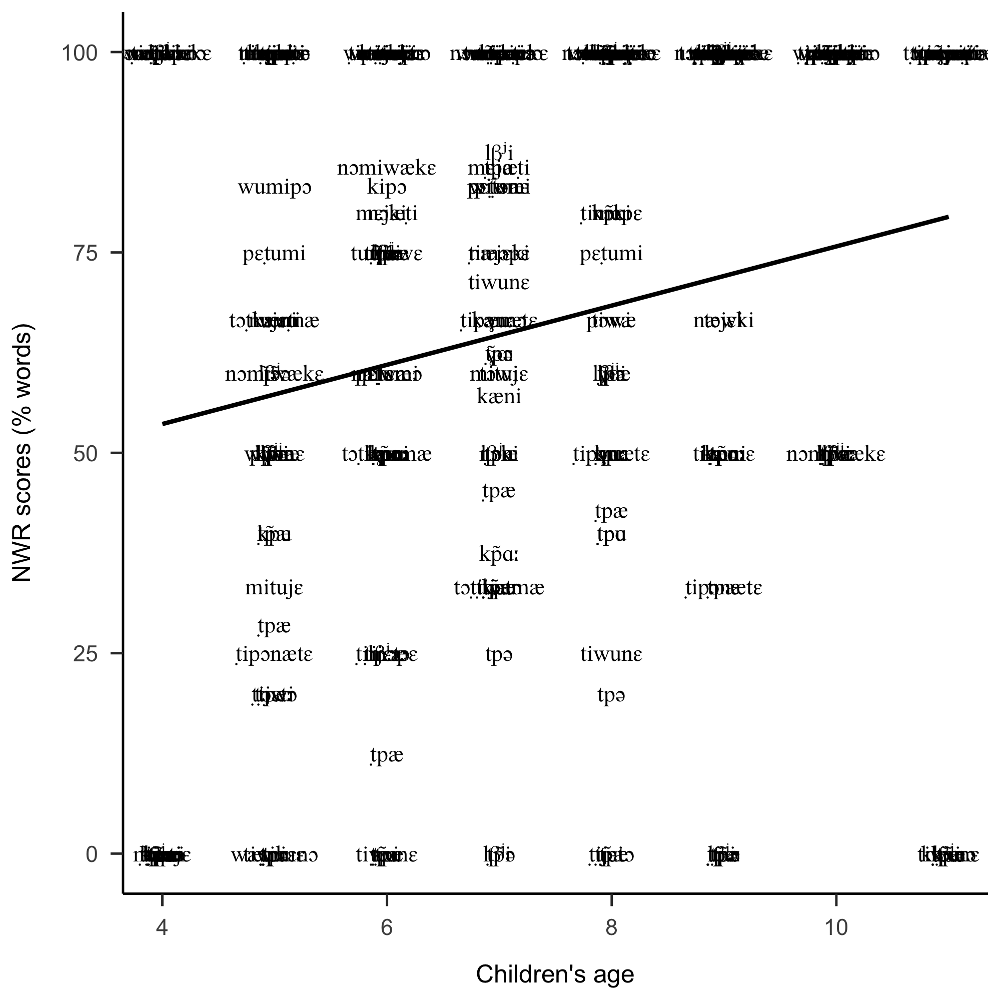

```{r setup, include=FALSE}
knitr::opts_chunk$set(echo = TRUE)
```

## TODO
We have included information about the stimulus length in the caption of the figures.


## SM1: Systematic review of previous work to check whether length there are typological differences in length effects on NWR

```{r prep-prevlit, echo=F}
pl<- read.csv("previous_lit.csv")

pl_stacked=cbind(pl[,c("Study","Language","n","Age")],stack(pl[c("X1","X2","X3","X4")]),stack(pl[c("sd1","sd2","sd3","sd4")]))
colnames(pl_stacked)[5:8]<-c("Median","Length","SD","sdtype")
pl_stacked$Length=gsub("X","",pl_stacked$Length)

#remove lines with NA median
pl_stacked[!is.na(pl_stacked$Median),]->pl_stacked


#add YD data
aggregate(trnsc.inc$correct*100,by=list(trnsc.inc$id,trnsc.inc$type,trnsc.inc$age.rounded),mean,na.rm=T)->m_ty_id_age #get means by child and length and age

age_cuts=c(3,6,8,13)
m_ty_id_age$age_g=cut(m_ty_id_age$Group.3,age_cuts) #apply cuts to define groups
m_ty_id_age$age_gm<-ifelse(m_ty_id_age$age_g=="(3,6]",4.5,ifelse(m_ty_id_age$age_g=="(6,8]",7,10))


aggregate(m_ty_id_age$x,by=list(m_ty_id_age$Group.2,m_ty_id_age$age_gm),median,na.rm=T)->yd_res #get avg across children within age groups
yd_res=cbind(yd_res,aggregate(m_ty_id_age$x,by=list(m_ty_id_age$Group.2,m_ty_id_age$age_gm),sd,na.rm=T)$x,aggregate(m_ty_id_age$x,by=list(m_ty_id_age$Group.2,m_ty_id_age$age_gm),length)$x) #add sd & ns

colnames(yd_res)<-c("Length","Age","Median","SD","n")
yd_res_toadd=cbind("This paper","Yélî Dnye",yd_res[,c("n","Age","Median","Length","SD")],NA)
colnames(yd_res_toadd)<-c("Study","Language","n","Age","Median","Length","SD","sdtype")

#combine
pl_stacked=rbind(pl_stacked,yd_res_toadd)

#add SE
pl_stacked$se=pl_stacked$SD/sqrt(pl_stacked$n)

#remove monosyllables
pl_stacked=pl_stacked[pl_stacked$Length!=1,]

pl_stacked$Language=factor(pl_stacked$Language)


pl$dif<-pl$X2-pl$X3
difs=aggregate(pl$dif,by=list(pl$Language),mean, na.rm=T)
```


ADD MORE INFO ABOUT HOW THESE PAPERS WERE DISCOVERED

 We do not think previous literature fitting these predictions, we inspected NWR papers in a variety of languages which reported NWR scores separately for different word lengths, as described in Supplementary Materials. We found data for learners of Israeli Arabic  [@jabere2018xperiment]; Cantonese  [@stokes2006nonword]; English  [@vance2005speech]; Italian  [@piazzalunga2019articulatory]; and Tsimane'  [@cristia2020infant]. 
Our reading of that work is that, although there is cross-linguistic (or cross-sample) variation in length effects, these do not systematically line up with expected word length in different languages. For instance, the difference in NWR scores for 2- versus 3-syllable items (averaging across age groups) is largest in Tsimane' (~`r round(difs[difs$Group.1=="Tsimane'","x"])`%) and Arabic (~`r round(difs[difs$Group.1=="Arabic","x"])`%), which tend to have longer words, as does Italian, where the difference between 2- and 3-syllable items was only ~`r round(difs[difs$Group.1=="Italian","x"])`%. Similarly, two languages that are often described as heavily biased towards monosyllables show diverse length effects (Cantonese ~`r round(difs[difs$Group.1=="Cantonese","x"])`% versus English ~`r round(difs[difs$Group.1=="English","x"])`%).

```{r prep-prevlit, echo=F}
pl<- read.csv("previous_lit.csv")

pl_stacked=cbind(pl[,c("Study","Language","n","Age")],stack(pl[c("X1","X2","X3","X4")]),stack(pl[c("sd1","sd2","sd3","sd4")]))
colnames(pl_stacked)[5:8]<-c("Median","Length","SD","sdtype")
pl_stacked$Length=gsub("X","",pl_stacked$Length)

#remove lines with NA median
pl_stacked[!is.na(pl_stacked$Median),]->pl_stacked


#add YD data
aggregate(trnsc.inc$correct*100,by=list(trnsc.inc$id,trnsc.inc$type,trnsc.inc$age.rounded),mean,na.rm=T)->m_ty_id_age #get means by child and length and age

age_cuts=c(3,6,8,13)
m_ty_id_age$age_g=cut(m_ty_id_age$Group.3,age_cuts) #apply cuts to define groups
m_ty_id_age$age_gm<-ifelse(m_ty_id_age$age_g=="(3,6]",4.5,ifelse(m_ty_id_age$age_g=="(6,8]",7,10))


aggregate(m_ty_id_age$x,by=list(m_ty_id_age$Group.2,m_ty_id_age$age_gm),median,na.rm=T)->yd_res #get avg across children within age groups
yd_res=cbind(yd_res,aggregate(m_ty_id_age$x,by=list(m_ty_id_age$Group.2,m_ty_id_age$age_gm),sd,na.rm=T)$x,aggregate(m_ty_id_age$x,by=list(m_ty_id_age$Group.2,m_ty_id_age$age_gm),length)$x) #add sd & ns

colnames(yd_res)<-c("Length","Age","Median","SD","n")
yd_res_toadd=cbind("This paper","Yélî Dnye",yd_res[,c("n","Age","Median","Length","SD")],NA)
colnames(yd_res_toadd)<-c("Study","Language","n","Age","Median","Length","SD","sdtype")

#combine
pl_stacked=rbind(pl_stacked,yd_res_toadd)

#add SE
pl_stacked$se=pl_stacked$SD/sqrt(pl_stacked$n)

#remove monosyllables
pl_stacked=pl_stacked[pl_stacked$Length!=1,]

pl_stacked$Language=factor(pl_stacked$Language)


pl$dif<-pl$X2-pl$X3
difs=aggregate(pl$dif,by=list(pl$Language),mean, na.rm=T)
```


```{r fig-prevlit, echo = FALSE, ig.pos = "T!", fig.width=8, fig.height=5.5, fig.cap = "NWR scores as a function of age (in years) and item length for comparable studies (2-4 indicating number of syllables,  2=dashed, 3=dotted, 4=dotted and dashed). Jaber-Awida (2018) reported on 20 Israeli Arabic learners (orange); Piazzalunga et al. (2019) reported on groups of 24-60 Italian learners (black); Stokes et al. (2006) on 15 Cantonese learners (blue); Vance et al. (2005) on 17-20 English learners (light green); Cristia et al. (2020) reported on groups of 4-6 Tsimane' learners (dark green); the present study reports on groups of 8-19 Yélî Dnye learners (purple). Central tendency is the mean except for Italian and Yélî Dnye (median); error is one standard error. Age has been slightly shifted for ease of inspection of different lengths at a given age."}


mycols = c( 
             "Arabic" = "orange",
             "Italian"   ="black",
             "Cantonese"   ="blue",
             "English"   ="green",
            "Tsimane'" = "darkgreen",
             "Yélî Dnye" = "purple")

mywd = c( 
             "Arabic" = 1,
             "Italian"   =1,
             "Cantonese"   =1,
             "English"   =1,
             "Tsimane'" = 2,
             "Yélî Dnye" = 4)

#just a trick to jitter age
jit_age=(pl_stacked$Age+(as.numeric(as.character(pl_stacked$Length))-2)/5)

plot(1,xlab="Average age (years)",ylab="NWR scores (words)",ylim=c(0,100),xlim=range(pl_stacked$Age))


for(thislang in levels(pl_stacked$Language)) for(thislength in levels(factor(pl_stacked$Length[pl_stacked$Language== thislang]))){
  myx=pl_stacked$Age[pl_stacked$Language==thislang & pl_stacked$Length==thislength]
  myx=myx+(as.numeric(as.character(thislength))-2)/5 #jitter the length lines a little bit with respect to avg age
  points(pl_stacked$Median[pl_stacked$Language==thislang & pl_stacked$Length==thislength]~myx,col=mycols[thislang],pch=as.character(thislength))
  myy=pl_stacked$Median[pl_stacked$Language==thislang & pl_stacked$Length==thislength]
  lines(myy~myx, col=mycols[thislang],lty=as.numeric(thislength),lwd=mywd[thislang]) #join points of same length & lang
  mylb=myy-pl_stacked$se[pl_stacked$Language==thislang & pl_stacked$Length==thislength]
  myhb=myy+pl_stacked$se[pl_stacked$Language==thislang & pl_stacked$Length==thislength]
  for(i in 1:length(mylb)) {
    mylty=as.numeric(as.character(thislength))
    lines(rep(myx[i],2),c(mylb[i],myhb[i]),col=mycols[thislang],lty=mylty) #error bar
    lines(c(myx[i]-.1,myx[i]+.1),c(mylb[i],mylb[i]),col=mycols[thislang],lty=mylty) #lower error bar tip
    lines(c(myx[i]-.1,myx[i]+.1),c(myhb[i],myhb[i]),col=mycols[thislang],lty=mylty) #higher error bar tip
    }
} 


```


```{r prep-pl}

pl_overall=pl[,1:7]

#add YD data
yd_res_toadd[yd_res_toadd$Length!=1,]->yd_res_toadd
means=aggregate(yd_res_toadd$Median,by=list(yd_res_toadd$Study,yd_res_toadd$Language,yd_res_toadd$n,yd_res_toadd$Age),mean)
sds=aggregate(yd_res_toadd$SD,by=list(yd_res_toadd$Study,yd_res_toadd$Language,yd_res_toadd$n,yd_res_toadd$Age),mean)
yd_res_toadd2=cbind(means,sds$x)

colnames(yd_res_toadd2)<-c("Study","Language","n","Age","Overall","SD")
yd_res_toadd2$Lengths<-"2-4"
yd_res_toadd2=yd_res_toadd2[,c("Study","Language","n","Age","Lengths","Overall","SD")]

#combine
pl_overall=rbind(pl_overall,yd_res_toadd2)

pl_overall$Language<-gsub(" (.*)","",pl_overall$Language)


read.csv("lang-char.tsv",sep="\t")->lang
merge(pl_overall,lang,by="Language")->pl_overall

#add SE
pl_overall$se=pl_overall$SD/sqrt(pl_overall$n)

#pairs(pl_overall[c("Overall","nchar","phones","words")])

#cor.test(pl_overall$Overall,pl_overall$nchar)
#t.test(pl_overall$Overall~pl_overall$words)

all_lang=levels(factor(pl_overall$Language))

```

## SM2: Integrating data from other studies


To enrich this discussion, we looked for previous studies on monolingual children with normative development learning diverse languages, and entered them when they reported non-word repetition scores based on whole item scoring. We entered data from XX studies (including ours), presenting data from XX languages. Specifically, Arabic was represented by @jabere2018xperiment; Cantonese by @stokes2006nonword; English by @vance2005speech; Italian by @piazzalunga2019articulatory; Mandarin by @lei2011developmental; Persian by @farmani2018normalization; Slovak by @kapalkova2013non and @polivsenska2014improving; Sotho by @wilsenach2013phonological; Spanish by @balladares2016socio; Swedish by @kalnak2014nonword and @radeborg2006swedish; Tsimane' by @cristia2020infant; and Yélî Dnye from the present study. Studies varied in the length of non-words that were considered; whenever results were reported separately for different lengths, we calculated overall averages based on lengths of 2 and 3 syllables, for increased comparability. Results separating different age groups are shown in Figure \@ref(fig:fig-prevlit-overall).

FIGURE REMOVED

Several observations can be drawn from this figure. To begin with, we focus on the comparison between Yélî Dnye and Tsimane'. These two groups have been described as having roughly similar levels of child-directed speech, yet they exhibit very different results: Tsimane' shows lower overall NWR scores (and according to Figure  \@ref(fig:fig-prevlit), larger length effects). This suggests that the lower NWR scores found among the Tsimane' are due to long-term effects of lower levels of child-directed speech. Naturally, there is an alternative interpretation, namely that input estimation suggesting very slightly higher levels of child-directed speech among the Tsimane' than among Yélî Dnye learners is inaccurate. In fact, careful reading of previous reports highlight important methodological differences in how input quantity has been estimated across papers: @casillas2020early hand-coded speech with the help of a native research assistant, and then summed all child-directed speech, which effectively establishes an upper boundary of the speech children could potentially process. @cristia2019child estimated quantities from behavioral observations on the frequency of child-directed one-on-one conversation, which is probably closer to a lower boundary. Finally, @scaff2021daylong used human annotation for detecting speech but an automated temporal method for assigning speech as child-directed or not, in a way that could lead to over-estimation (because any speech by e.g. a female adult that was not temporally close to speech by others would count as child-directed). A final answer to the question of how much child-directed speech is afforded to Yélî and Tsimane' children must await fully comparable methods.

That said, @cristia2020infant also pointed out another characteristic of the Tsimane' population, and this was the relatively low prevalence of literacy, and generally the variable access to formal education. This is a very different case from the Yélî population studied here, where nearly all adults have accumulated several years of schooling, and basic literacy in English (and sometimes Yélî Dnye) is widespread. If this second hypothesis holds, then this may mean that there are phonetic effects of learning to read in the input afforded to young children, and that this has consequences for young children's encoding and decoding of sounds in the context of NWR tasks. Notice that this is not the same as the oft-recorded effect of learning to read affecting NWR performance, illustrated for instance in the data for Sotho in Figure \@ref(fig:fig-prevlit-overall). These two data points have been gathered from two groups of children, all exposed mainly to Sotho, but children with higher NWR had been learning to read in Sotho, whereas those with lower scores were learning to read in English. What is at stake in our proposed alternative interpretation of the lower scores observed among the Tsimane' is related  to literacy *in the broader population* (rather than in the tested children themselves).

Although exciting, this hypothesis is only one of many. Another plausible explanation is that the Tsimane' results are not comparable to the previous body of literature, and specifically to our study. @cristia2020infant administered the NWR in the form of a group game played outside, with a non-native experimenter providing the target, and each person of the group attempting it in their stead. This immediately means a number of important methodological differences with the standard implementation of NWR, where children are tested individually, they hear items spoken by a native speaker (often over headphones), the experimenter tends to belong to the same community as the children, and testing occurs in quiet conditions (with little background noise). Thus, a priority is for additional data gathered using this more novel testing paradigm in other populations, or from the Tsimane' using the more traditional paradigm.

Broadening our discussion to all of the studies in our literature review, we notice that there is rather wide variation of the range of NWR scores found across these samples, and that, in fact, the strength of age effects also varies. We performed some exploratory analyses to see whether features of the languages children were learning could be related to their overall NWR scores. We extracted the number of phonemes in the language from PHOIBLE and coded whether words in the language tended to be longer or shorter based on information in the papers or other sources. Neither of these two predictors explained variance in Figure \@ref(fig:fig-prevlit-overall). It is possible that average word length plays a role, but often researchers incorporate this into their design by including longer items when the native language allows this, with e.g. Sotho non-words having 4-7 syllables in length. 

```{r fig-prevlit-overall, echo = FALSE, ig.pos = "T!", fig.width=8, fig.height=5.5, fig.cap = "NWR scores as a function of age (in years), averaged across multiple non-word lengths, as a function of children's native languages. The legend indicates language and the length of non-words (in syllables). Central tendency is mean; error is one standard error."}
mycols = c( 
             "Arabic" = "orange",
             "Cantonese"   ="blue",
             "English"   ="green",
             "Italian"   ="black",
             "Mandarin"   ="gray",
             "Persian"   ="pink",
             "Slovak"   ="lightblue",
            "Sotho"   ="magenta",
            "Spanish"   ="brown",
            "Swedish"   ="red",
            "Tsimane'" = "darkgreen",
             "Yélî" = "purple")

mywd = c( 
             "Arabic" = 1,
             "Cantonese"   =1,
             "English"   =1,
             "Italian"   =1,
             "Mandarin"   =1,
             "Persian"   =1,
             "Slovak"   =1,
            "Sotho"   =1,
            "Spanish"   =1,
            "Swedish"   =1,
             "Tsimane'" = 2,
             "Yélî" = 4)

plot(pl_overall$Overall~pl_overall$Age,col=mycols[pl_overall$Language],pch=1,
     xlab="Average age (years)",ylab="NWR scores (words)",ylim=c(0,100))

for(thislang in levels(factor(pl_overall$Language))) {
  myx=pl_overall$Age[pl_overall$Language==thislang ]
  myy=pl_overall$Overall[pl_overall$Language==thislang]
  lines(myy~myx, col=mycols[thislang],lwd=mywd[thislang]) #join points of same length & lang
  mylb=myy-pl_overall$se[pl_overall$Language==thislang]
  myhb=myy+pl_overall$se[pl_overall$Language==thislang]
  for(i in 1:length(mylb)) {
    
    lines(rep(myx[i],2),c(mylb[i],myhb[i]),col=mycols[thislang]) #error bar
    lines(c(myx[i]-.1,myx[i]+.1),c(mylb[i],mylb[i]),col=mycols[thislang]) #lower error bar tip
    lines(c(myx[i]-.1,myx[i]+.1),c(myhb[i],myhb[i]),col=mycols[thislang]) #higher error bar tip
    }
} 

#add legend
#first half of langs
xmin=6
ymax=30
ymin=0
myy=seq(from=ymax,to=ymin,length.out=length(all_lang)/2)
names(myy)<-all_lang[1:(length(all_lang)/2)]
for(thislang in names(myy)){
  lines(c(xmin-.1,xmin+.1),c(myy[thislang],myy[thislang]),col=mycols[thislang]) #line sample
  text(xmin+.15,myy[thislang],paste(thislang,pl_overall$Lengths[pl_overall$Language==thislang][1]),col=mycols[thislang],pos=4)
} 

#second half
xmin=9.5
names(myy)<-all_lang[(length(all_lang)/2+1):length(all_lang)]
for(thislang in names(myy)){
  lines(c(xmin-.1,xmin+.1),c(myy[thislang],myy[thislang]),col=mycols[thislang]) #line sample
  text(xmin+.15,myy[thislang],paste(thislang,pl_overall$Lengths[pl_overall$Language==thislang][1]),col=mycols[thislang],pos=4)
} 
```

## SM2: Age effects on accuracy


```{r fig-xage, fig.pos = "!t", fig.align = "center", out.width = '65%', fig.cap="NWR scores for individual target words as a function of the child's age (averaged in years)."}
aggregate(trnsc.inc$correct*100,by=list(trnsc.inc$target,round(trnsc.inc$age.rounded)),mean)->xage
colnames(xage)<-c("Target","Age","Word")
#stims.ipa <- read.xlsx("stimuli.xlsx") %>%
#  select(target, target_ortho, phono)
xage <- merge(xage, stims.ipa, by.x = "Target", by.y = "target")

item.plot <- ggplot(data = xage, aes(x = Age, y = Word, label = phono)) +
  geom_smooth(method = "lm", se = FALSE, color = "black") +
  geom_text(family = "Doulos SIL") +
  ylab("NWR scores (% words)") +
  xlab("Children's age") +
  theme_apa()
ggsave("nwr.by.age.ITEM.png", dpi = 300, device = png())



```
